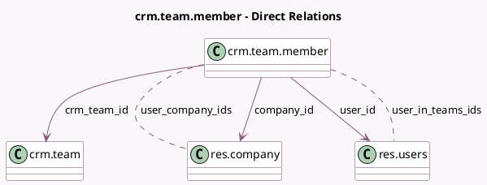

<!-- GENERATED:MODEL -->
---
tags: [odoo, community, generated, model]
---

# crm.team.member

- Module: [[docs/Community Addons/sales_team/sales_team|sales_team]]
- Scope: Community Addons
- Defined in module: yes
- Source files: `models/crm_team_member.py`
- Python classes: `CrmTeamMember`
- Description: Sales Team Member
- Inherits: `mail.thread`

## Field footprint

- Detected fields: 13
- Field types: `Boolean` x 2, `Char` x 3, `Image` x 2, `Many2many` x 2, `Many2one` x 3, `Text` x 1
- Relation fields: 5

## Sample fields

- `active`: `Boolean`
- `company_id`: `Many2one` (comodel `res.company`, related `user_id.company_id`)
- `crm_team_id`: `Many2one` (comodel `crm.team`)
- `email`: `Char` (related `user_id.email`)
- `image_128`: `Image` (comodel `Image (128)`, related `user_id.image_128`)
- `image_1920`: `Image` (comodel `Image`, related `user_id.image_1920`)
- `is_membership_multi`: `Boolean` (comodel `Multiple Memberships Allowed`, compute `_compute_is_membership_multi`)
- `member_warning`: `Text` (compute `_compute_member_warning`)
- `name`: `Char` (related `user_id.display_name`)
- `phone`: `Char` (related `user_id.phone`)
- `user_company_ids`: `Many2many` (comodel `res.company`, compute `_compute_user_company_ids`)
- `user_id`: `Many2one` (comodel `res.users`)
- `user_in_teams_ids`: `Many2many` (comodel `res.users`, compute `_compute_user_in_teams_ids`)

## Method hints

- Detected methods: 8
- Action methods: none
- Compute methods: `_compute_is_membership_multi`, `_compute_member_warning`, `_compute_user_company_ids`, `_compute_user_in_teams_ids`
- Onchange methods: none

## Direct relation diagram

## Navigation

- **Parent:** [[docs/Community Addons/sales_team/Models]]

<!-- GENERATED:MODEL -->
