<!-- GENERATED:MODEL -->
---
tags: [odoo, community, generated, model]
---

# res.users

- Module: [[docs/Community Addons/sales_team/sales_team|sales_team]]
- Scope: Community Addons
- Defined in module: extension only
- Source files: `models/res_users.py`
- Python classes: `ResUsers`

## Field footprint

- Detected fields: 3
- Field types: `Many2many` x 1, `Many2one` x 1, `One2many` x 1
- Relation fields: 3

## Sample fields

- `crm_team_ids`: `Many2many` (comodel `crm.team`, compute `_compute_crm_team_ids`)
- `crm_team_member_ids`: `One2many` (comodel `crm.team.member`)
- `sale_team_id`: `Many2one` (comodel `crm.team`, compute `_compute_sale_team_id`, store `True`)

## Method hints

- Detected methods: 4
- Action methods: `action_archive`
- Compute methods: `_compute_crm_team_ids`, `_compute_sale_team_id`
- Onchange methods: none

## Direct relation diagram

```plantuml
@startuml
!define ODOO_COLOR_PRIMARY #714B67
!define ODOO_COLOR_ACCENT #875A7B
!define ODOO_COLOR_BG #FAF7FA

skinparam backgroundColor ODOO_COLOR_BG
skinparam defaultTextAlignment left
skinparam ArrowColor ODOO_COLOR_ACCENT
skinparam ClassBackgroundColor white
skinparam ClassBorderColor ODOO_COLOR_PRIMARY
skinparam ComponentBackgroundColor white
skinparam ComponentBorderColor ODOO_COLOR_PRIMARY
skinparam NoteBackgroundColor #FFF8FF
skinparam NoteBorderColor ODOO_COLOR_ACCENT
skinparam SequenceLifeLineBorderColor ODOO_COLOR_ACCENT
skinparam SequenceLifeLineBackgroundColor #FFFFFF
skinparam SequenceParticipantBorderColor ODOO_COLOR_PRIMARY
skinparam SequenceParticipantBackgroundColor #FFFFFF
skinparam sequence {
  ArrowColor ODOO_COLOR_ACCENT
  ActorBorderColor ODOO_COLOR_PRIMARY
}
title res.users - Direct Relations
class "res.users" as res_users
class "crm.team" as crm_team
class "crm.team.member" as crm_team_member
res_users .. crm_team : crm_team_ids
res_users --|> crm_team_member : crm_team_member_ids
res_users --> crm_team : sale_team_id
@enduml
```

## Navigation

- **Parent:** [[docs/Community Addons/sales_team/Models]]

<!-- GENERATED:MODEL -->
