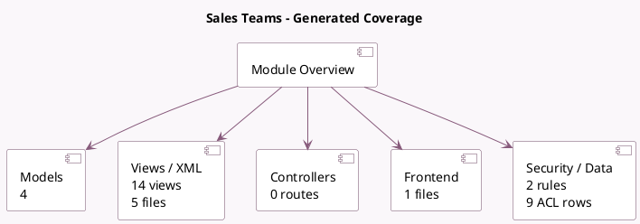

<!-- GENERATED:MODULE -->
---
tags: [odoo, community, module]
---

# Sales Teams

- Scope: Community Addons
- Source: odoo/addons/sales_team
- Dependencies: base (not documented), [[docs/Community Addons/mail/mail|mail]]

## Summary

Sales Teams

## Generated coverage

- Models: 4
- XML files with UI/data artifacts: 5
- Views: 14
- Actions: 6
- Menus: 0
- Rules (ir.rule): 2
- Access CSV entries: 9
- Controller units: 0
- Frontend asset files: 1

## Module map

## Detail notes

- Models: [[docs/Community Addons/sales_team/Models|Models]] (4)
- Views and XML: [[docs/Community Addons/sales_team/Views|Views]] (5 files)
- Frontend: [[docs/Community Addons/sales_team/Frontend|Frontend]] (1 files)

## Key models

- `crm.tag`
- `crm.team`
- `crm.team.member`
- `res.users`

## Navigation

- [[../Community Addons/Community Addons|Back to scope]]
- [[../../docs/docs|Back to docs]]

<!-- GENERATED:MODULE -->

