<!-- GENERATED:MODEL -->
---
tags: [odoo, community, generated, model]
---

# sms.account.sender

- Module: [[docs/Community Addons/sms/sms|sms]]
- Scope: Community Addons
- Defined in module: yes
- Source files: `wizard/sms_account_sender.py`
- Python classes: `SmsAccountSender`
- Description: SMS Account Sender Name Wizard

## Field footprint

- Detected fields: 2
- Field types: `Char` x 1, `Many2one` x 1
- Relation fields: 1

## Sample fields

- `account_id`: `Many2one` (comodel `iap.account`)
- `sender_name`: `Char`

## Method hints

- Detected methods: 2
- Action methods: `action_set_sender_name`
- Compute methods: none
- Onchange methods: none

## Direct relation diagram

```plantuml
@startuml
!define ODOO_COLOR_PRIMARY #714B67
!define ODOO_COLOR_ACCENT #875A7B
!define ODOO_COLOR_BG #FAF7FA

skinparam backgroundColor ODOO_COLOR_BG
skinparam defaultTextAlignment left
skinparam ArrowColor ODOO_COLOR_ACCENT
skinparam ClassBackgroundColor white
skinparam ClassBorderColor ODOO_COLOR_PRIMARY
skinparam ComponentBackgroundColor white
skinparam ComponentBorderColor ODOO_COLOR_PRIMARY
skinparam NoteBackgroundColor #FFF8FF
skinparam NoteBorderColor ODOO_COLOR_ACCENT
skinparam SequenceLifeLineBorderColor ODOO_COLOR_ACCENT
skinparam SequenceLifeLineBackgroundColor #FFFFFF
skinparam SequenceParticipantBorderColor ODOO_COLOR_PRIMARY
skinparam SequenceParticipantBackgroundColor #FFFFFF
skinparam sequence {
  ArrowColor ODOO_COLOR_ACCENT
  ActorBorderColor ODOO_COLOR_PRIMARY
}
title sms.account.sender - Direct Relations
class "sms.account.sender" as sms_account_sender
class "iap.account" as iap_account
sms_account_sender --> iap_account : account_id
@enduml
```

## Navigation

- **Parent:** [[docs/Community Addons/sms/Models]]

<!-- GENERATED:MODEL -->
