<!-- GENERATED:MODEL -->
---
tags: [odoo, community, generated, model]
---

# sms.composer

- Module: [[docs/Community Addons/sms/sms|sms]]
- Scope: Community Addons
- Defined in module: yes
- Source files: `wizard/sms_composer.py`
- Python classes: `SmsComposer`
- Description: Send SMS Wizard

## Field footprint

- Detected fields: 21
- Field types: `Boolean` x 5, `Char` x 8, `Integer` x 4, `Many2one` x 1, `Selection` x 1, `Text` x 2
- Relation fields: 1

## Sample fields

- `body`: `Text` (comodel `Message`, compute `_compute_body`, store `True`)
- `comment_single_recipient`: `Boolean` (comodel `Single Mode`, compute `_compute_comment_single_recipient`)
- `composition_mode`: `Selection` (compute `_compute_composition_mode`, store `True`)
- `mass_force_send`: `Boolean` (comodel `Send directly`)
- `mass_keep_log`: `Boolean` (comodel `Keep a note on document`)
- `number_field_name`: `Char` (comodel `Number Field`)
- `numbers`: `Char` (comodel `Recipients (Numbers)`)
- `recipient_invalid_count`: `Integer` (comodel `# Invalid recipients`, compute `_compute_recipients`)
- `recipient_single_description`: `Text` (comodel `Recipients (Partners)`, compute `_compute_recipient_single_non_stored`)
- `recipient_single_number`: `Char` (comodel `Stored Recipient Number`, compute `_compute_recipient_single_non_stored`)
- `recipient_single_number_itf`: `Char` (comodel `Recipient Number`, compute `_compute_recipient_single_stored`, store `True`)
- `recipient_single_valid`: `Boolean` (comodel `Is valid`, compute `_compute_recipient_single_valid`)
- `recipient_valid_count`: `Integer` (comodel `# Valid recipients`, compute `_compute_recipients`)
- `res_id`: `Integer` (comodel `Document ID`)
- `res_ids`: `Char` (comodel `Document IDs`)
- `res_ids_count`: `Integer` (comodel `Visible records count`, compute `_compute_res_ids_count`)
- `res_model`: `Char` (comodel `Document Model Name`)
- `res_model_description`: `Char` (comodel `Document Model Description`, compute `_compute_res_model_description`)
- `sanitized_numbers`: `Char` (comodel `Sanitized Number`, compute `_compute_sanitized_numbers`)
- `template_id`: `Many2one` (comodel `sms.template`)

## Method hints

- Detected methods: 31
- Action methods: `action_send_sms`, `action_send_sms_mass_now`
- Compute methods: `_compute_body`, `_compute_comment_single_recipient`, `_compute_composition_mode`, `_compute_recipient_single_non_stored`, `_compute_recipient_single_stored`, `_compute_recipient_single_valid`, `_compute_recipients`, `_compute_res_ids_count`, and 2 more
- Onchange methods: none

## Direct relation diagram

```plantuml
@startuml
!define ODOO_COLOR_PRIMARY #714B67
!define ODOO_COLOR_ACCENT #875A7B
!define ODOO_COLOR_BG #FAF7FA

skinparam backgroundColor ODOO_COLOR_BG
skinparam defaultTextAlignment left
skinparam ArrowColor ODOO_COLOR_ACCENT
skinparam ClassBackgroundColor white
skinparam ClassBorderColor ODOO_COLOR_PRIMARY
skinparam ComponentBackgroundColor white
skinparam ComponentBorderColor ODOO_COLOR_PRIMARY
skinparam NoteBackgroundColor #FFF8FF
skinparam NoteBorderColor ODOO_COLOR_ACCENT
skinparam SequenceLifeLineBorderColor ODOO_COLOR_ACCENT
skinparam SequenceLifeLineBackgroundColor #FFFFFF
skinparam SequenceParticipantBorderColor ODOO_COLOR_PRIMARY
skinparam SequenceParticipantBackgroundColor #FFFFFF
skinparam sequence {
  ArrowColor ODOO_COLOR_ACCENT
  ActorBorderColor ODOO_COLOR_PRIMARY
}
title sms.composer - Direct Relations
class "sms.composer" as sms_composer
class "sms.template" as sms_template
sms_composer --> sms_template : template_id
@enduml
```

## Navigation

- **Parent:** [[docs/Community Addons/sms/Models]]

<!-- GENERATED:MODEL -->
