<!-- GENERATED:MODEL -->
---
tags: [odoo, community, generated, model]
---

# sms.sms

- Module: [[docs/Community Addons/sms/sms|sms]]
- Scope: Community Addons
- Defined in module: yes
- Source files: `models/sms_sms.py`
- Python classes: `SmsSms`
- Description: Outgoing SMS

## Field footprint

- Detected fields: 9
- Field types: `Boolean` x 1, `Char` x 2, `Many2one` x 3, `Selection` x 2, `Text` x 1
- Relation fields: 3

## Sample fields

- `body`: `Text`
- `failure_type`: `Selection`
- `mail_message_id`: `Many2one` (comodel `mail.message`)
- `number`: `Char` (comodel `Number`)
- `partner_id`: `Many2one` (comodel `res.partner`)
- `sms_tracker_id`: `Many2one` (comodel `sms.tracker`, compute `_compute_sms_tracker_id`)
- `state`: `Selection`
- `to_delete`: `Boolean` (comodel `Marked for deletion`)
- `uuid`: `Char` (comodel `UUID`)

## Method hints

- Detected methods: 17
- Action methods: `action_set_canceled`, `action_set_error`, `action_set_outgoing`
- Compute methods: `_compute_sms_tracker_id`
- Onchange methods: none

## Direct relation diagram

```plantuml
@startuml
!define ODOO_COLOR_PRIMARY #714B67
!define ODOO_COLOR_ACCENT #875A7B
!define ODOO_COLOR_BG #FAF7FA

skinparam backgroundColor ODOO_COLOR_BG
skinparam defaultTextAlignment left
skinparam ArrowColor ODOO_COLOR_ACCENT
skinparam ClassBackgroundColor white
skinparam ClassBorderColor ODOO_COLOR_PRIMARY
skinparam ComponentBackgroundColor white
skinparam ComponentBorderColor ODOO_COLOR_PRIMARY
skinparam NoteBackgroundColor #FFF8FF
skinparam NoteBorderColor ODOO_COLOR_ACCENT
skinparam SequenceLifeLineBorderColor ODOO_COLOR_ACCENT
skinparam SequenceLifeLineBackgroundColor #FFFFFF
skinparam SequenceParticipantBorderColor ODOO_COLOR_PRIMARY
skinparam SequenceParticipantBackgroundColor #FFFFFF
skinparam sequence {
  ArrowColor ODOO_COLOR_ACCENT
  ActorBorderColor ODOO_COLOR_PRIMARY
}
title sms.sms - Direct Relations
class "sms.sms" as sms_sms
class "mail.message" as mail_message
class "res.partner" as res_partner
class "sms.tracker" as sms_tracker
sms_sms --> res_partner : partner_id
sms_sms --> mail_message : mail_message_id
sms_sms --> sms_tracker : sms_tracker_id
@enduml
```

## Navigation

- **Parent:** [[docs/Community Addons/sms/Models]]

<!-- GENERATED:MODEL -->
