<!-- GENERATED:MODEL -->
---
tags: [odoo, community, generated, model]
---

# sms.template

- Module: [[docs/Community Addons/sms/sms|sms]]
- Scope: Community Addons
- Defined in module: yes
- Source files: `models/sms_template.py`
- Python classes: `SmsTemplate`
- Description: SMS Templates
- Inherits: `mail.render.mixin`, `template.reset.mixin`

## Field footprint

- Detected fields: 5
- Field types: `Char` x 3, `Many2one` x 2
- Relation fields: 2

## Sample fields

- `body`: `Char` (comodel `Body`)
- `model`: `Char` (comodel `Related Document Model`, related `model_id.model`, store `True`)
- `model_id`: `Many2one` (comodel `ir.model`)
- `name`: `Char` (comodel `Name`)
- `sidebar_action_id`: `Many2one` (comodel `ir.actions.act_window`)

## Method hints

- Detected methods: 6
- Action methods: `action_create_sidebar_action`, `action_unlink_sidebar_action`
- Compute methods: `_compute_render_model`
- Onchange methods: none

## Direct relation diagram

```plantuml
@startuml
!define ODOO_COLOR_PRIMARY #714B67
!define ODOO_COLOR_ACCENT #875A7B
!define ODOO_COLOR_BG #FAF7FA

skinparam backgroundColor ODOO_COLOR_BG
skinparam defaultTextAlignment left
skinparam ArrowColor ODOO_COLOR_ACCENT
skinparam ClassBackgroundColor white
skinparam ClassBorderColor ODOO_COLOR_PRIMARY
skinparam ComponentBackgroundColor white
skinparam ComponentBorderColor ODOO_COLOR_PRIMARY
skinparam NoteBackgroundColor #FFF8FF
skinparam NoteBorderColor ODOO_COLOR_ACCENT
skinparam SequenceLifeLineBorderColor ODOO_COLOR_ACCENT
skinparam SequenceLifeLineBackgroundColor #FFFFFF
skinparam SequenceParticipantBorderColor ODOO_COLOR_PRIMARY
skinparam SequenceParticipantBackgroundColor #FFFFFF
skinparam sequence {
  ArrowColor ODOO_COLOR_ACCENT
  ActorBorderColor ODOO_COLOR_PRIMARY
}
title sms.template - Direct Relations
class "sms.template" as sms_template
class "ir.actions.act_window" as ir_actions_act_window
class "ir.model" as ir_model
sms_template --> ir_model : model_id
sms_template --> ir_actions_act_window : sidebar_action_id
@enduml
```

## Navigation

- **Parent:** [[docs/Community Addons/sms/Models]]

<!-- GENERATED:MODEL -->
