<!-- GENERATED:MODEL -->
---
tags: [odoo, community, generated, model]
---

# sms.template.preview

- Module: [[docs/Community Addons/sms/sms|sms]]
- Scope: Community Addons
- Defined in module: yes
- Source files: `wizard/sms_template_preview.py`
- Python classes: `SmsTemplatePreview`
- Description: SMS Template Preview

## Field footprint

- Detected fields: 6
- Field types: `Boolean` x 1, `Char` x 1, `Many2one` x 2, `Reference` x 1, `Selection` x 1
- Relation fields: 2

## Sample fields

- `body`: `Char` (comodel `Body`, compute `_compute_sms_template_fields`)
- `lang`: `Selection`
- `model_id`: `Many2one` (comodel `ir.model`, related `sms_template_id.model_id`)
- `no_record`: `Boolean` (comodel `No Record`, compute `_compute_no_record`)
- `resource_ref`: `Reference`
- `sms_template_id`: `Many2one` (comodel `sms.template`)

## Method hints

- Detected methods: 5
- Action methods: none
- Compute methods: `_compute_no_record`, `_compute_sms_template_fields`
- Onchange methods: none

## Direct relation diagram

```plantuml
@startuml
!define ODOO_COLOR_PRIMARY #714B67
!define ODOO_COLOR_ACCENT #875A7B
!define ODOO_COLOR_BG #FAF7FA

skinparam backgroundColor ODOO_COLOR_BG
skinparam defaultTextAlignment left
skinparam ArrowColor ODOO_COLOR_ACCENT
skinparam ClassBackgroundColor white
skinparam ClassBorderColor ODOO_COLOR_PRIMARY
skinparam ComponentBackgroundColor white
skinparam ComponentBorderColor ODOO_COLOR_PRIMARY
skinparam NoteBackgroundColor #FFF8FF
skinparam NoteBorderColor ODOO_COLOR_ACCENT
skinparam SequenceLifeLineBorderColor ODOO_COLOR_ACCENT
skinparam SequenceLifeLineBackgroundColor #FFFFFF
skinparam SequenceParticipantBorderColor ODOO_COLOR_PRIMARY
skinparam SequenceParticipantBackgroundColor #FFFFFF
skinparam sequence {
  ArrowColor ODOO_COLOR_ACCENT
  ActorBorderColor ODOO_COLOR_PRIMARY
}
title sms.template.preview - Direct Relations
class "sms.template.preview" as sms_template_preview
class "ir.model" as ir_model
class "sms.template" as sms_template
sms_template_preview --> sms_template : sms_template_id
sms_template_preview --> ir_model : model_id
@enduml
```

## Navigation

- **Parent:** [[docs/Community Addons/sms/Models]]

<!-- GENERATED:MODEL -->
