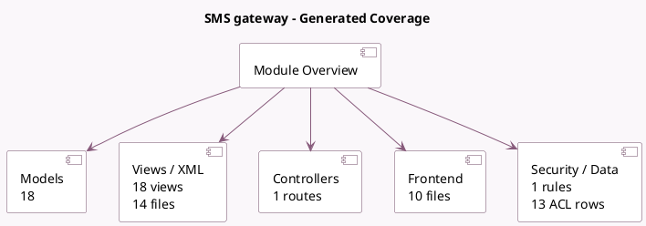

<!-- GENERATED:MODULE -->
---
tags: [odoo, community, module]
---

# SMS gateway

- Scope: Community Addons
- Source: odoo/addons/sms
- Dependencies: base (not documented), [[docs/Community Addons/iap_mail/iap_mail|iap_mail]], [[docs/Community Addons/mail/mail|mail]], [[docs/Community Addons/phone_validation/phone_validation|phone_validation]]

## Summary

SMS Text Messaging

## Generated coverage

- Models: 18
- XML files with UI/data artifacts: 14
- Views: 18
- Actions: 8
- Menus: 2
- Rules (ir.rule): 1
- Access CSV entries: 13
- Controller units: 1
- Frontend asset files: 10

## Module map

## Detail notes

- Models: [[docs/Community Addons/sms/Models|Models]] (18)
- Views and XML: [[docs/Community Addons/sms/Views|Views]] (14 files)
- Controllers: [[docs/Community Addons/sms/Controllers|Controllers]] (1)
- Frontend: [[docs/Community Addons/sms/Frontend|Frontend]] (10 files)

## Key models

- `base`
- `iap.account`
- `ir.actions.server`
- `ir.model`
- `mail.followers`
- `mail.message`
- `mail.notification`
- `mail.thread`
- `res.company`
- `sms.account.code`
- `sms.account.phone`
- `sms.account.sender`

## Navigation

- [[../Community Addons/Community Addons|Back to scope]]
- [[../../docs/docs|Back to docs]]

<!-- GENERATED:MODULE -->

