<!-- GENERATED:MODEL -->
---
tags: [odoo, community, generated, model]
---

# sms.twilio.account.manage

- Module: [[docs/Community Addons/sms_twilio/sms_twilio|sms_twilio]]
- Scope: Community Addons
- Defined in module: yes
- Source files: `wizard/sms_twilio_account_manage.py`
- Python classes: `SmsTwilioAccountManage`
- Description: SMS Twilio Connection Wizard

## Field footprint

- Detected fields: 6
- Field types: `Char` x 3, `Many2one` x 1, `One2many` x 1, `Selection` x 1
- Relation fields: 2

## Sample fields

- `company_id`: `Many2one` (comodel `res.company`)
- `sms_provider`: `Selection` (related `company_id.sms_provider`)
- `sms_twilio_account_sid`: `Char` (related `company_id.sms_twilio_account_sid`)
- `sms_twilio_auth_token`: `Char` (related `company_id.sms_twilio_auth_token`)
- `sms_twilio_number_ids`: `One2many` (related `company_id.sms_twilio_number_ids`)
- `test_number`: `Char` (comodel `Test Number`)

## Method hints

- Detected methods: 4
- Action methods: `action_reload_numbers`, `action_save`, `action_send_test`
- Compute methods: none
- Onchange methods: none

## Direct relation diagram

```plantuml
@startuml
!define ODOO_COLOR_PRIMARY #714B67
!define ODOO_COLOR_ACCENT #875A7B
!define ODOO_COLOR_BG #FAF7FA

skinparam backgroundColor ODOO_COLOR_BG
skinparam defaultTextAlignment left
skinparam ArrowColor ODOO_COLOR_ACCENT
skinparam ClassBackgroundColor white
skinparam ClassBorderColor ODOO_COLOR_PRIMARY
skinparam ComponentBackgroundColor white
skinparam ComponentBorderColor ODOO_COLOR_PRIMARY
skinparam NoteBackgroundColor #FFF8FF
skinparam NoteBorderColor ODOO_COLOR_ACCENT
skinparam SequenceLifeLineBorderColor ODOO_COLOR_ACCENT
skinparam SequenceLifeLineBackgroundColor #FFFFFF
skinparam SequenceParticipantBorderColor ODOO_COLOR_PRIMARY
skinparam SequenceParticipantBackgroundColor #FFFFFF
skinparam sequence {
  ArrowColor ODOO_COLOR_ACCENT
  ActorBorderColor ODOO_COLOR_PRIMARY
}
title sms.twilio.account.manage - Direct Relations
class "sms.twilio.account.manage" as sms_twilio_account_manage
class "res.company" as res_company
sms_twilio_account_manage --> res_company : company_id
@enduml
```

## Navigation

- **Parent:** [[docs/Community Addons/sms_twilio/Models]]

<!-- GENERATED:MODEL -->
