<!-- GENERATED:MODEL -->
---
tags: [odoo, community, generated, model]
---

# sms.twilio.number

- Module: [[docs/Community Addons/sms_twilio/sms_twilio|sms_twilio]]
- Scope: Community Addons
- Defined in module: yes
- Source files: `models/sms_twilio_number.py`
- Python classes: `SmsTwilioNumber`
- Description: Twilio Number

## Field footprint

- Detected fields: 5
- Field types: `Char` x 2, `Integer` x 1, `Many2one` x 2
- Relation fields: 2

## Sample fields

- `company_id`: `Many2one` (comodel `res.company`)
- `country_code`: `Char` (related `country_id.code`)
- `country_id`: `Many2one` (comodel `res.country`)
- `number`: `Char`
- `sequence`: `Integer`

## Method hints

- Detected methods: 2
- Action methods: `action_unlink`
- Compute methods: `_compute_display_name`
- Onchange methods: none

## Direct relation diagram

```plantuml
@startuml
!define ODOO_COLOR_PRIMARY #714B67
!define ODOO_COLOR_ACCENT #875A7B
!define ODOO_COLOR_BG #FAF7FA

skinparam backgroundColor ODOO_COLOR_BG
skinparam defaultTextAlignment left
skinparam ArrowColor ODOO_COLOR_ACCENT
skinparam ClassBackgroundColor white
skinparam ClassBorderColor ODOO_COLOR_PRIMARY
skinparam ComponentBackgroundColor white
skinparam ComponentBorderColor ODOO_COLOR_PRIMARY
skinparam NoteBackgroundColor #FFF8FF
skinparam NoteBorderColor ODOO_COLOR_ACCENT
skinparam SequenceLifeLineBorderColor ODOO_COLOR_ACCENT
skinparam SequenceLifeLineBackgroundColor #FFFFFF
skinparam SequenceParticipantBorderColor ODOO_COLOR_PRIMARY
skinparam SequenceParticipantBackgroundColor #FFFFFF
skinparam sequence {
  ArrowColor ODOO_COLOR_ACCENT
  ActorBorderColor ODOO_COLOR_PRIMARY
}
title sms.twilio.number - Direct Relations
class "sms.twilio.number" as sms_twilio_number
class "res.company" as res_company
class "res.country" as res_country
sms_twilio_number --> res_company : company_id
sms_twilio_number --> res_country : country_id
@enduml
```

## Navigation

- **Parent:** [[docs/Community Addons/sms_twilio/Models]]

<!-- GENERATED:MODEL -->
