<!-- GENERATED:MODEL -->
---
tags: [odoo, community, generated, model]
---

# snailmail.letter

- Module: [[docs/Community Addons/snailmail/snailmail|snailmail]]
- Scope: Community Addons
- Defined in module: yes
- Source files: `models/snailmail_letter.py`
- Python classes: `SnailmailLetter`
- Description: Snailmail Letter

## Field footprint

- Detected fields: 24
- Field types: `Binary` x 1, `Boolean` x 3, `Char` x 7, `Html` x 1, `Integer` x 1, `Many2one` x 8, `One2many` x 1, `Selection` x 2
- Relation fields: 9

## Sample fields

- `attachment_datas`: `Binary` (comodel `Document`, related `attachment_id.datas`)
- `attachment_fname`: `Char` (comodel `Attachment Filename`, related `attachment_id.name`)
- `attachment_id`: `Many2one` (comodel `ir.attachment`)
- `city`: `Char` (comodel `City`)
- `color`: `Boolean`
- `company_id`: `Many2one` (comodel `res.company`)
- `country_id`: `Many2one` (comodel `res.country`)
- `cover`: `Boolean`
- `duplex`: `Boolean`
- `error_code`: `Selection`
- `info_msg`: `Html` (comodel `Information`)
- `message_id`: `Many2one` (comodel `mail.message`)
- `model`: `Char` (comodel `Model`)
- `notification_ids`: `One2many` (comodel `mail.notification`)
- `partner_id`: `Many2one` (comodel `res.partner`)
- `reference`: `Char` (compute `_compute_reference`, store `False`)
- `report_template`: `Many2one` (comodel `ir.actions.report`)
- `res_id`: `Integer` (comodel `Document ID`)
- `state`: `Selection`
- `state_id`: `Many2one` (comodel `res.country.state`)

## Method hints

- Detected methods: 19
- Action methods: none
- Compute methods: `_compute_display_name`, `_compute_reference`
- Onchange methods: none

## Direct relation diagram

```plantuml
@startuml
!define ODOO_COLOR_PRIMARY #714B67
!define ODOO_COLOR_ACCENT #875A7B
!define ODOO_COLOR_BG #FAF7FA

skinparam backgroundColor ODOO_COLOR_BG
skinparam defaultTextAlignment left
skinparam ArrowColor ODOO_COLOR_ACCENT
skinparam ClassBackgroundColor white
skinparam ClassBorderColor ODOO_COLOR_PRIMARY
skinparam ComponentBackgroundColor white
skinparam ComponentBorderColor ODOO_COLOR_PRIMARY
skinparam NoteBackgroundColor #FFF8FF
skinparam NoteBorderColor ODOO_COLOR_ACCENT
skinparam SequenceLifeLineBorderColor ODOO_COLOR_ACCENT
skinparam SequenceLifeLineBackgroundColor #FFFFFF
skinparam SequenceParticipantBorderColor ODOO_COLOR_PRIMARY
skinparam SequenceParticipantBackgroundColor #FFFFFF
skinparam sequence {
  ArrowColor ODOO_COLOR_ACCENT
  ActorBorderColor ODOO_COLOR_PRIMARY
}
title snailmail.letter - Direct Relations
class "snailmail.letter" as snailmail_letter
class "ir.actions.report" as ir_actions_report
class "ir.attachment" as ir_attachment
class "mail.message" as mail_message
class "mail.notification" as mail_notification
class "res.company" as res_company
class "res.country" as res_country
class "res.country.state" as res_country_state
class "res.partner" as res_partner
class "res.users" as res_users
snailmail_letter --> res_users : user_id
snailmail_letter --> res_partner : partner_id
snailmail_letter --> res_company : company_id
snailmail_letter --> ir_actions_report : report_template
snailmail_letter --> ir_attachment : attachment_id
snailmail_letter --> mail_message : message_id
snailmail_letter --|> mail_notification : notification_ids
snailmail_letter --> res_country_state : state_id
snailmail_letter --> res_country : country_id
@enduml
```

## Navigation

- **Parent:** [[docs/Community Addons/snailmail/Models]]

<!-- GENERATED:MODEL -->
