<!-- GENERATED:MODEL -->
---
tags: [odoo, community, generated, model]
---

# spreadsheet.dashboard.group

- Module: [[docs/Community Addons/spreadsheet_dashboard/spreadsheet_dashboard|spreadsheet_dashboard]]
- Scope: Community Addons
- Defined in module: yes
- Source files: `models/spreadsheet_dashboard_group.py`
- Python classes: `SpreadsheetDashboardGroup`
- Description: Group of dashboards

## Field footprint

- Detected fields: 4
- Field types: `Char` x 1, `Integer` x 1, `One2many` x 2
- Relation fields: 2

## Sample fields

- `dashboard_ids`: `One2many` (comodel `spreadsheet.dashboard`)
- `name`: `Char`
- `published_dashboard_ids`: `One2many` (comodel `spreadsheet.dashboard`)
- `sequence`: `Integer`

## Method hints

- Detected methods: 1
- Action methods: none
- Compute methods: none
- Onchange methods: none

## Direct relation diagram

```plantuml
@startuml
!define ODOO_COLOR_PRIMARY #714B67
!define ODOO_COLOR_ACCENT #875A7B
!define ODOO_COLOR_BG #FAF7FA

skinparam backgroundColor ODOO_COLOR_BG
skinparam defaultTextAlignment left
skinparam ArrowColor ODOO_COLOR_ACCENT
skinparam ClassBackgroundColor white
skinparam ClassBorderColor ODOO_COLOR_PRIMARY
skinparam ComponentBackgroundColor white
skinparam ComponentBorderColor ODOO_COLOR_PRIMARY
skinparam NoteBackgroundColor #FFF8FF
skinparam NoteBorderColor ODOO_COLOR_ACCENT
skinparam SequenceLifeLineBorderColor ODOO_COLOR_ACCENT
skinparam SequenceLifeLineBackgroundColor #FFFFFF
skinparam SequenceParticipantBorderColor ODOO_COLOR_PRIMARY
skinparam SequenceParticipantBackgroundColor #FFFFFF
skinparam sequence {
  ArrowColor ODOO_COLOR_ACCENT
  ActorBorderColor ODOO_COLOR_PRIMARY
}
title spreadsheet.dashboard.group - Direct Relations
class "spreadsheet.dashboard.group" as spreadsheet_dashboard_group
class "spreadsheet.dashboard" as spreadsheet_dashboard
spreadsheet_dashboard_group --|> spreadsheet_dashboard : dashboard_ids
spreadsheet_dashboard_group --|> spreadsheet_dashboard : published_dashboard_ids
@enduml
```

## Navigation

- **Parent:** [[docs/Community Addons/spreadsheet_dashboard/Models]]

<!-- GENERATED:MODEL -->
