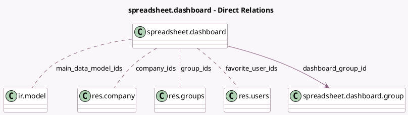

<!-- GENERATED:MODEL -->
---
tags: [odoo, community, generated, model]
---

# spreadsheet.dashboard

- Module: [[docs/Community Addons/spreadsheet_dashboard/spreadsheet_dashboard|spreadsheet_dashboard]]
- Scope: Community Addons
- Defined in module: yes
- Source files: `models/spreadsheet_dashboard.py`
- Python classes: `SpreadsheetDashboard`
- Description: Spreadsheet Dashboard
- Inherits: `spreadsheet.mixin`

## Field footprint

- Detected fields: 10
- Field types: `Boolean` x 2, `Char` x 2, `Integer` x 1, `Many2many` x 4, `Many2one` x 1
- Relation fields: 5

## Sample fields

- `company_ids`: `Many2many` (comodel `res.company`)
- `dashboard_group_id`: `Many2one` (comodel `spreadsheet.dashboard.group`)
- `favorite_user_ids`: `Many2many` (comodel `res.users`)
- `group_ids`: `Many2many` (comodel `res.groups`)
- `is_favorite`: `Boolean` (compute `_compute_is_favorite`)
- `is_published`: `Boolean`
- `main_data_model_ids`: `Many2many` (comodel `ir.model`)
- `name`: `Char`
- `sample_dashboard_file_path`: `Char`
- `sequence`: `Integer`

## Method hints

- Detected methods: 7
- Action methods: `action_toggle_favorite`
- Compute methods: `_compute_is_favorite`
- Onchange methods: none

## Direct relation diagram

## Navigation

- **Parent:** [[docs/Community Addons/spreadsheet_dashboard/Models]]

<!-- GENERATED:MODEL -->
