<!-- GENERATED:MODEL -->
---
tags: [odoo, community, generated, model]
---

# spreadsheet.dashboard.share

- Module: [[docs/Community Addons/spreadsheet_dashboard/spreadsheet_dashboard|spreadsheet_dashboard]]
- Scope: Community Addons
- Defined in module: yes
- Source files: `models/spreadsheet_dashboard_share.py`
- Python classes: `SpreadsheetDashboardShare`
- Description: Copy of a shared dashboard
- Inherits: `spreadsheet.mixin`

## Field footprint

- Detected fields: 5
- Field types: `Binary` x 1, `Char` x 3, `Many2one` x 1
- Relation fields: 1

## Sample fields

- `access_token`: `Char`
- `dashboard_id`: `Many2one` (comodel `spreadsheet.dashboard`)
- `excel_export`: `Binary`
- `full_url`: `Char` (compute `_compute_full_url`)
- `name`: `Char` (related `dashboard_id.name`)

## Method hints

- Detected methods: 4
- Action methods: `action_get_share_url`
- Compute methods: `_compute_full_url`
- Onchange methods: none

## Direct relation diagram

```plantuml
@startuml
!define ODOO_COLOR_PRIMARY #714B67
!define ODOO_COLOR_ACCENT #875A7B
!define ODOO_COLOR_BG #FAF7FA

skinparam backgroundColor ODOO_COLOR_BG
skinparam defaultTextAlignment left
skinparam ArrowColor ODOO_COLOR_ACCENT
skinparam ClassBackgroundColor white
skinparam ClassBorderColor ODOO_COLOR_PRIMARY
skinparam ComponentBackgroundColor white
skinparam ComponentBorderColor ODOO_COLOR_PRIMARY
skinparam NoteBackgroundColor #FFF8FF
skinparam NoteBorderColor ODOO_COLOR_ACCENT
skinparam SequenceLifeLineBorderColor ODOO_COLOR_ACCENT
skinparam SequenceLifeLineBackgroundColor #FFFFFF
skinparam SequenceParticipantBorderColor ODOO_COLOR_PRIMARY
skinparam SequenceParticipantBackgroundColor #FFFFFF
skinparam sequence {
  ArrowColor ODOO_COLOR_ACCENT
  ActorBorderColor ODOO_COLOR_PRIMARY
}
title spreadsheet.dashboard.share - Direct Relations
class "spreadsheet.dashboard.share" as spreadsheet_dashboard_share
class "spreadsheet.dashboard" as spreadsheet_dashboard
spreadsheet_dashboard_share --> spreadsheet_dashboard : dashboard_id
@enduml
```

## Navigation

- **Parent:** [[docs/Community Addons/spreadsheet_dashboard/Models]]

<!-- GENERATED:MODEL -->
