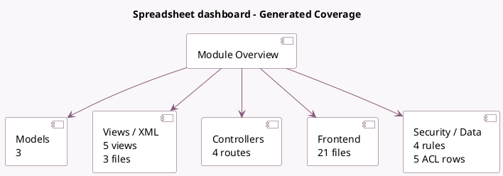

<!-- GENERATED:MODULE -->
---
tags: [odoo, community, module]
---

# Spreadsheet dashboard

- Scope: Community Addons
- Source: odoo/addons/spreadsheet_dashboard
- Dependencies: [[docs/Community Addons/spreadsheet/spreadsheet|spreadsheet]]

## Summary

Spreadsheet

## Generated coverage

- Models: 3
- XML files with UI/data artifacts: 3
- Views: 5
- Actions: 2
- Menus: 4
- Rules (ir.rule): 4
- Access CSV entries: 5
- Controller units: 2
- Frontend asset files: 21

## Module map

## Detail notes

- Models: [[docs/Community Addons/spreadsheet_dashboard/Models|Models]] (3)
- Views and XML: [[docs/Community Addons/spreadsheet_dashboard/Views|Views]] (3 files)
- Controllers: [[docs/Community Addons/spreadsheet_dashboard/Controllers|Controllers]] (2)
- Frontend: [[docs/Community Addons/spreadsheet_dashboard/Frontend|Frontend]] (21 files)

## Key models

- `spreadsheet.dashboard`
- `spreadsheet.dashboard.group`
- `spreadsheet.dashboard.share`

## Navigation

- [[../Community Addons/Community Addons|Back to scope]]
- [[../../docs/docs|Back to docs]]

<!-- GENERATED:MODULE -->

