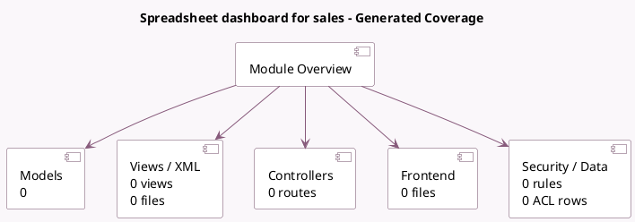

<!-- GENERATED:MODULE -->
---
tags: [odoo, community, module]
---

# Spreadsheet dashboard for sales

- Scope: Community Addons
- Source: odoo/addons/spreadsheet_dashboard_sale
- Dependencies: [[docs/Community Addons/spreadsheet_dashboard/spreadsheet_dashboard|spreadsheet_dashboard]], [[docs/Community Addons/sale/sale|sale]]

## Summary

Spreadsheet

## Generated coverage

- Models: 0
- XML files with UI/data artifacts: 0
- Views: 0
- Actions: 0
- Menus: 0
- Rules (ir.rule): 0
- Access CSV entries: 0
- Controller units: 0
- Frontend asset files: 0

## Module map

## Navigation

- [[../Community Addons/Community Addons|Back to scope]]
- [[../../docs/docs|Back to docs]]

<!-- GENERATED:MODULE -->

