<!-- GENERATED:MODEL -->
---
tags: [odoo, community, generated, model]
---

# lot.label.layout

- Module: [[docs/Community Addons/stock/stock|stock]]
- Scope: Community Addons
- Defined in module: yes
- Source files: `wizard/stock_lot_label_layout.py`
- Python classes: `LotLabelLayout`
- Description: Choose the sheet layout to print lot labels

## Field footprint

- Detected fields: 3
- Field types: `Many2many` x 1, `Selection` x 2
- Relation fields: 1

## Sample fields

- `label_quantity`: `Selection`
- `move_line_ids`: `Many2many` (comodel `stock.move.line`)
- `print_format`: `Selection`

## Method hints

- Detected methods: 1
- Action methods: none
- Compute methods: none
- Onchange methods: none

## Direct relation diagram

```plantuml
@startuml
!define ODOO_COLOR_PRIMARY #714B67
!define ODOO_COLOR_ACCENT #875A7B
!define ODOO_COLOR_BG #FAF7FA

skinparam backgroundColor ODOO_COLOR_BG
skinparam defaultTextAlignment left
skinparam ArrowColor ODOO_COLOR_ACCENT
skinparam ClassBackgroundColor white
skinparam ClassBorderColor ODOO_COLOR_PRIMARY
skinparam ComponentBackgroundColor white
skinparam ComponentBorderColor ODOO_COLOR_PRIMARY
skinparam NoteBackgroundColor #FFF8FF
skinparam NoteBorderColor ODOO_COLOR_ACCENT
skinparam SequenceLifeLineBorderColor ODOO_COLOR_ACCENT
skinparam SequenceLifeLineBackgroundColor #FFFFFF
skinparam SequenceParticipantBorderColor ODOO_COLOR_PRIMARY
skinparam SequenceParticipantBackgroundColor #FFFFFF
skinparam sequence {
  ArrowColor ODOO_COLOR_ACCENT
  ActorBorderColor ODOO_COLOR_PRIMARY
}
title lot.label.layout - Direct Relations
class "lot.label.layout" as lot_label_layout
class "stock.move.line" as stock_move_line
lot_label_layout .. stock_move_line : move_line_ids
@enduml
```

## Navigation

- **Parent:** [[docs/Community Addons/stock/Models]]

<!-- GENERATED:MODEL -->
