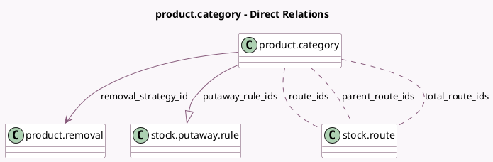

<!-- GENERATED:MODEL -->
---
tags: [odoo, community, generated, model]
---

# product.category

- Module: [[docs/Community Addons/stock/stock|stock]]
- Scope: Community Addons
- Defined in module: extension only
- Source files: `models/product.py`
- Python classes: `ProductCategory`

## Field footprint

- Detected fields: 7
- Field types: `Boolean` x 1, `Many2many` x 3, `Many2one` x 1, `One2many` x 1, `Selection` x 1
- Relation fields: 5

## Sample fields

- `filter_for_stock_putaway_rule`: `Boolean` (comodel `stock.putaway.rule`, store `False`)
- `packaging_reserve_method`: `Selection`
- `parent_route_ids`: `Many2many` (comodel `stock.route`, compute `_compute_parent_route_ids`)
- `putaway_rule_ids`: `One2many` (comodel `stock.putaway.rule`)
- `removal_strategy_id`: `Many2one` (comodel `product.removal`)
- `route_ids`: `Many2many` (comodel `stock.route`)
- `total_route_ids`: `Many2many` (comodel `stock.route`, compute `_compute_total_route_ids`)

## Method hints

- Detected methods: 4
- Action methods: none
- Compute methods: `_compute_parent_route_ids`, `_compute_total_route_ids`
- Onchange methods: none

## Direct relation diagram

## Navigation

- **Parent:** [[docs/Community Addons/stock/Models]]

<!-- GENERATED:MODEL -->
