<!-- GENERATED:MODEL -->
---
tags: [odoo, community, generated, model]
---

# product.label.layout

- Module: [[docs/Community Addons/stock/stock|stock]]
- Scope: Community Addons
- Defined in module: extension only
- Source files: `wizard/product_label_layout.py`
- Python classes: `ProductLabelLayout`

## Field footprint

- Detected fields: 5
- Field types: `Image` x 1, `Many2many` x 1, `Selection` x 3
- Relation fields: 1

## Sample fields

- `move_ids`: `Many2many` (comodel `stock.move`)
- `move_quantity`: `Selection`
- `print_format`: `Selection`
- `zpl_preview`: `Image` (comodel `ZPL Preview`)
- `zpl_template`: `Selection`

## Method hints

- Detected methods: 2
- Action methods: none
- Compute methods: none
- Onchange methods: none

## Direct relation diagram

```plantuml
@startuml
!define ODOO_COLOR_PRIMARY #714B67
!define ODOO_COLOR_ACCENT #875A7B
!define ODOO_COLOR_BG #FAF7FA

skinparam backgroundColor ODOO_COLOR_BG
skinparam defaultTextAlignment left
skinparam ArrowColor ODOO_COLOR_ACCENT
skinparam ClassBackgroundColor white
skinparam ClassBorderColor ODOO_COLOR_PRIMARY
skinparam ComponentBackgroundColor white
skinparam ComponentBorderColor ODOO_COLOR_PRIMARY
skinparam NoteBackgroundColor #FFF8FF
skinparam NoteBorderColor ODOO_COLOR_ACCENT
skinparam SequenceLifeLineBorderColor ODOO_COLOR_ACCENT
skinparam SequenceLifeLineBackgroundColor #FFFFFF
skinparam SequenceParticipantBorderColor ODOO_COLOR_PRIMARY
skinparam SequenceParticipantBackgroundColor #FFFFFF
skinparam sequence {
  ArrowColor ODOO_COLOR_ACCENT
  ActorBorderColor ODOO_COLOR_PRIMARY
}
title product.label.layout - Direct Relations
class "product.label.layout" as product_label_layout
class "stock.move" as stock_move
product_label_layout .. stock_move : move_ids
@enduml
```

## Navigation

- **Parent:** [[docs/Community Addons/stock/Models]]

<!-- GENERATED:MODEL -->
