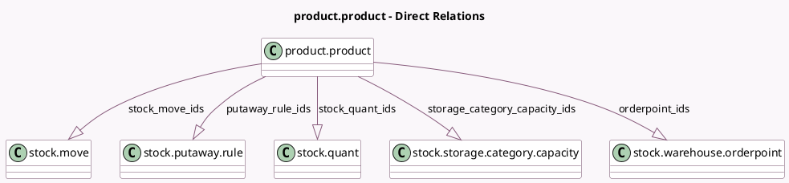

<!-- GENERATED:MODEL -->
---
tags: [odoo, community, generated, model]
---

# product.product

- Module: [[docs/Community Addons/stock/stock|stock]]
- Scope: Community Addons
- Defined in module: extension only
- Source files: `models/product.py`
- Python classes: `ProductProduct`

## Field footprint

- Detected fields: 20
- Field types: `Boolean` x 4, `Float` x 7, `Integer` x 3, `One2many` x 5, `PropertiesDefinition` x 1
- Relation fields: 5

## Sample fields

- `free_qty`: `Float` (comodel `Free To Use Quantity `, compute `_compute_quantities`)
- `incoming_qty`: `Float` (comodel `Incoming`, compute `_compute_quantities`)
- `lot_properties_definition`: `PropertiesDefinition` (comodel `Lot Properties`)
- `nbr_moves_in`: `Integer` (compute `_compute_nbr_moves`)
- `nbr_moves_out`: `Integer` (compute `_compute_nbr_moves`)
- `nbr_reordering_rules`: `Integer` (comodel `Reordering Rules`, compute `_compute_nbr_reordering_rules`)
- `orderpoint_ids`: `One2many` (comodel `stock.warehouse.orderpoint`)
- `outgoing_qty`: `Float` (comodel `Outgoing`, compute `_compute_quantities`)
- `putaway_rule_ids`: `One2many` (comodel `stock.putaway.rule`)
- `qty_available`: `Float` (comodel `Quantity On Hand`, compute `_compute_quantities`)
- `reordering_max_qty`: `Float` (compute `_compute_nbr_reordering_rules`)
- `reordering_min_qty`: `Float` (compute `_compute_nbr_reordering_rules`)
- `show_forecasted_qty_status_button`: `Boolean` (compute `_compute_show_qty_status_button`)
- `show_on_hand_qty_status_button`: `Boolean` (compute `_compute_show_qty_status_button`)
- `show_qty_update_button`: `Boolean` (compute `_compute_show_qty_update_button`)
- `stock_move_ids`: `One2many` (comodel `stock.move`)
- `stock_quant_ids`: `One2many` (comodel `stock.quant`)
- `storage_category_capacity_ids`: `One2many` (comodel `stock.storage.category.capacity`)
- `valid_ean`: `Boolean` (comodel `Barcode is valid EAN`, compute `_compute_valid_ean`)
- `virtual_available`: `Float` (comodel `Forecasted Quantity`, compute `_compute_quantities`)

## Method hints

- Detected methods: 42
- Action methods: `action_open_product_lot`, `action_open_quants`, `action_product_forecast_report`, `action_view_orderpoints`, `action_view_related_putaway_rules`, `action_view_routes`, `action_view_stock_move_lines`, `action_view_storage_category_capacity`
- Compute methods: `_compute_nbr_moves`, `_compute_nbr_reordering_rules`, `_compute_quantities`, `_compute_quantities_dict`, `_compute_show_qty_status_button`, `_compute_show_qty_update_button`, `_compute_valid_ean`
- Onchange methods: `_onchange_tracking`

## Direct relation diagram

## Navigation

- **Parent:** [[docs/Community Addons/stock/Models]]

<!-- GENERATED:MODEL -->
