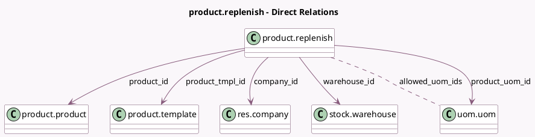

<!-- GENERATED:MODEL -->
---
tags: [odoo, community, generated, model]
---

# product.replenish

- Module: [[docs/Community Addons/stock/stock|stock]]
- Scope: Community Addons
- Defined in module: yes
- Source files: `wizard/product_replenish.py`
- Python classes: `ProductReplenish`
- Description: Product Replenish
- Inherits: `stock.replenish.mixin`

## Field footprint

- Detected fields: 11
- Field types: `Boolean` x 1, `Datetime` x 1, `Float` x 2, `Many2many` x 1, `Many2one` x 6
- Relation fields: 7

## Sample fields

- `allowed_uom_ids`: `Many2many` (comodel `uom.uom`, compute `_compute_allowed_uom_ids`)
- `company_id`: `Many2one` (comodel `res.company`)
- `date_planned`: `Datetime` (comodel `Scheduled Date`, compute `_compute_date_planned`, store `True`)
- `forecast_uom_id`: `Many2one` (related `product_id.uom_id`)
- `forecasted_quantity`: `Float` (compute `_compute_forecasted_quantity`)
- `product_has_variants`: `Boolean` (comodel `Has variants`)
- `product_id`: `Many2one` (comodel `product.product`)
- `product_tmpl_id`: `Many2one` (comodel `product.template`)
- `product_uom_id`: `Many2one` (comodel `uom.uom`)
- `quantity`: `Float` (comodel `Quantity`)
- `warehouse_id`: `Many2one` (comodel `stock.warehouse`)

## Method hints

- Detected methods: 13
- Action methods: none
- Compute methods: `_compute_allowed_uom_ids`, `_compute_date_planned`, `_compute_forecasted_quantity`
- Onchange methods: `_onchange_product_id`

## Direct relation diagram

## Navigation

- **Parent:** [[docs/Community Addons/stock/Models]]

<!-- GENERATED:MODEL -->
