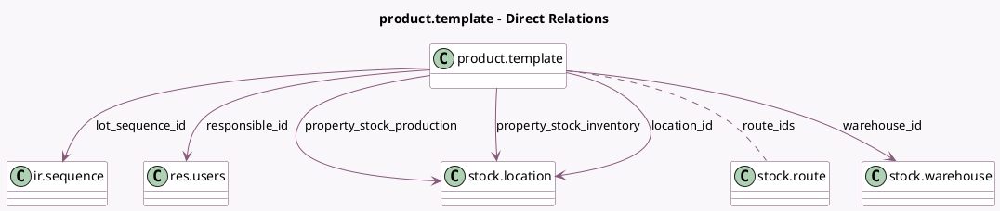

<!-- GENERATED:MODEL -->
---
tags: [odoo, community, generated, model]
---

# product.template

- Module: [[docs/Community Addons/stock/stock|stock]]
- Scope: Community Addons
- Defined in module: extension only
- Source files: `models/product.py`
- Python classes: `ProductTemplate`

## Field footprint

- Detected fields: 29
- Field types: `Boolean` x 5, `Char` x 2, `Float` x 6, `Integer` x 4, `Many2many` x 2, `Many2one` x 6, `Selection` x 1, `Text` x 3
- Relation fields: 8

## Sample fields

- `description_picking`: `Text` (comodel `Description on Picking`)
- `description_pickingin`: `Text` (comodel `Description on Receptions`)
- `description_pickingout`: `Text` (comodel `Description on Delivery Orders`)
- `has_available_route_ids`: `Boolean` (comodel `Routes can be selected on this product`, compute `_compute_has_available_route_ids`)
- `incoming_qty`: `Float` (comodel `Incoming`, compute `_compute_quantities`)
- `is_storable`: `Boolean` (comodel `Track Inventory`, compute `compute_is_storable`, store `True`)
- `location_id`: `Many2one` (comodel `stock.location`, store `False`)
- `lot_sequence_id`: `Many2one` (comodel `ir.sequence`)
- `nbr_moves_in`: `Integer` (compute `_compute_nbr_moves`)
- `nbr_moves_out`: `Integer` (compute `_compute_nbr_moves`)
- `nbr_reordering_rules`: `Integer` (comodel `Reordering Rules`, compute `_compute_nbr_reordering_rules`)
- `next_serial`: `Char` (compute `_compute_next_serial`)
- `outgoing_qty`: `Float` (comodel `Outgoing`, compute `_compute_quantities`)
- `property_stock_inventory`: `Many2one` (comodel `stock.location`)
- `property_stock_production`: `Many2one` (comodel `stock.location`)
- `qty_available`: `Float` (comodel `Quantity On Hand`, compute `_compute_quantities`)
- `reordering_max_qty`: `Float` (compute `_compute_nbr_reordering_rules`)
- `reordering_min_qty`: `Float` (compute `_compute_nbr_reordering_rules`)
- `responsible_id`: `Many2one` (comodel `res.users`)
- `route_from_categ_ids`: `Many2many` (related `categ_id.total_route_ids`)

## Method hints

- Detected methods: 33
- Action methods: `action_open_product_lot`, `action_open_quants`, `action_open_routes_diagram`, `action_product_tmpl_forecast_report`, `action_view_orderpoints`, `action_view_related_putaway_rules`, `action_view_stock_move_lines`, `action_view_storage_category_capacity`
- Compute methods: `_compute_has_available_route_ids`, `_compute_nbr_moves`, `_compute_nbr_reordering_rules`, `_compute_next_serial`, `_compute_quantities`, `_compute_quantities_dict`, `_compute_serial_prefix_format`, `_compute_show_qty_status_button`, and 2 more
- Onchange methods: `_onchange_tracking`, `_onchange_type`

## Direct relation diagram

## Navigation

- **Parent:** [[docs/Community Addons/stock/Models]]

<!-- GENERATED:MODEL -->
