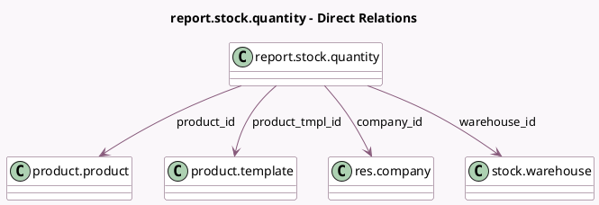

<!-- GENERATED:MODEL -->
---
tags: [odoo, community, generated, model]
---

# report.stock.quantity

- Module: [[docs/Community Addons/stock/stock|stock]]
- Scope: Community Addons
- Defined in module: yes
- Source files: `report/report_stock_quantity.py`
- Python classes: `ReportStockQuantity`
- Description: Stock Quantity Report

## Field footprint

- Detected fields: 7
- Field types: `Date` x 1, `Float` x 1, `Many2one` x 4, `Selection` x 1
- Relation fields: 4

## Sample fields

- `company_id`: `Many2one` (comodel `res.company`)
- `date`: `Date`
- `product_id`: `Many2one` (comodel `product.product`)
- `product_qty`: `Float`
- `product_tmpl_id`: `Many2one` (comodel `product.template`)
- `state`: `Selection`
- `warehouse_id`: `Many2one` (comodel `stock.warehouse`)

## Method hints

- Detected methods: 2
- Action methods: none
- Compute methods: none
- Onchange methods: none

## Direct relation diagram

## Navigation

- **Parent:** [[docs/Community Addons/stock/Models]]

<!-- GENERATED:MODEL -->
