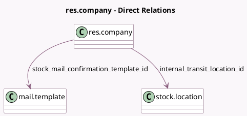

<!-- GENERATED:MODEL -->
---
tags: [odoo, community, generated, model]
---

# res.company

- Module: [[docs/Community Addons/stock/stock|stock]]
- Scope: Community Addons
- Defined in module: extension only
- Source files: `models/res_company.py`
- Python classes: `ResCompany`

## Field footprint

- Detected fields: 8
- Field types: `Boolean` x 2, `Float` x 1, `Integer` x 1, `Many2one` x 2, `Selection` x 2
- Relation fields: 2

## Sample fields

- `annual_inventory_day`: `Integer`
- `annual_inventory_month`: `Selection`
- `horizon_days`: `Float`
- `internal_transit_location_id`: `Many2one` (comodel `stock.location`)
- `stock_confirmation_type`: `Selection`
- `stock_mail_confirmation_template_id`: `Many2one` (comodel `mail.template`)
- `stock_move_email_validation`: `Boolean` (comodel `Email Confirmation picking`)
- `stock_text_confirmation`: `Boolean` (comodel `Stock Text Confirmation`)

## Method hints

- Detected methods: 19
- Action methods: none
- Compute methods: none
- Onchange methods: none

## Direct relation diagram

## Navigation

- **Parent:** [[docs/Community Addons/stock/Models]]

<!-- GENERATED:MODEL -->
