<!-- GENERATED:MODEL -->
---
tags: [odoo, community, generated, model]
---

# stock.backorder.confirmation

- Module: [[docs/Community Addons/stock/stock|stock]]
- Scope: Community Addons
- Defined in module: yes
- Source files: `wizard/stock_backorder_confirmation.py`
- Python classes: `StockBackorderConfirmation`
- Description: Backorder Confirmation

## Field footprint

- Detected fields: 3
- Field types: `Boolean` x 1, `Many2many` x 1, `One2many` x 1
- Relation fields: 2

## Sample fields

- `backorder_confirmation_line_ids`: `One2many` (comodel `stock.backorder.confirmation.line`)
- `pick_ids`: `Many2many` (comodel `stock.picking`)
- `show_transfers`: `Boolean`

## Method hints

- Detected methods: 4
- Action methods: none
- Compute methods: none
- Onchange methods: none

## Direct relation diagram

```plantuml
@startuml
!define ODOO_COLOR_PRIMARY #714B67
!define ODOO_COLOR_ACCENT #875A7B
!define ODOO_COLOR_BG #FAF7FA

skinparam backgroundColor ODOO_COLOR_BG
skinparam defaultTextAlignment left
skinparam ArrowColor ODOO_COLOR_ACCENT
skinparam ClassBackgroundColor white
skinparam ClassBorderColor ODOO_COLOR_PRIMARY
skinparam ComponentBackgroundColor white
skinparam ComponentBorderColor ODOO_COLOR_PRIMARY
skinparam NoteBackgroundColor #FFF8FF
skinparam NoteBorderColor ODOO_COLOR_ACCENT
skinparam SequenceLifeLineBorderColor ODOO_COLOR_ACCENT
skinparam SequenceLifeLineBackgroundColor #FFFFFF
skinparam SequenceParticipantBorderColor ODOO_COLOR_PRIMARY
skinparam SequenceParticipantBackgroundColor #FFFFFF
skinparam sequence {
  ArrowColor ODOO_COLOR_ACCENT
  ActorBorderColor ODOO_COLOR_PRIMARY
}
title stock.backorder.confirmation - Direct Relations
class "stock.backorder.confirmation" as stock_backorder_confirmation
class "stock.backorder.confirmation.line" as stock_backorder_confirmation_line
class "stock.picking" as stock_picking
stock_backorder_confirmation .. stock_picking : pick_ids
stock_backorder_confirmation --|> stock_backorder_confirmation_line : backorder_confirmation_line_ids
@enduml
```

## Navigation

- **Parent:** [[docs/Community Addons/stock/Models]]

<!-- GENERATED:MODEL -->
