<!-- GENERATED:MODEL -->
---
tags: [odoo, community, generated, model]
---

# stock.inventory.adjustment.name

- Module: [[docs/Community Addons/stock/stock|stock]]
- Scope: Community Addons
- Defined in module: yes
- Source files: `wizard/stock_inventory_adjustment_name.py`
- Python classes: `StockInventoryAdjustmentName`
- Description: Inventory Adjustment Reference / Reason

## Field footprint

- Detected fields: 3
- Field types: `Char` x 1, `Datetime` x 1, `Many2many` x 1
- Relation fields: 1

## Sample fields

- `counting_date`: `Datetime`
- `inventory_adjustment_name`: `Char`
- `quant_ids`: `Many2many` (comodel `stock.quant`)

## Method hints

- Detected methods: 2
- Action methods: `action_apply`
- Compute methods: none
- Onchange methods: none

## Direct relation diagram

```plantuml
@startuml
!define ODOO_COLOR_PRIMARY #714B67
!define ODOO_COLOR_ACCENT #875A7B
!define ODOO_COLOR_BG #FAF7FA

skinparam backgroundColor ODOO_COLOR_BG
skinparam defaultTextAlignment left
skinparam ArrowColor ODOO_COLOR_ACCENT
skinparam ClassBackgroundColor white
skinparam ClassBorderColor ODOO_COLOR_PRIMARY
skinparam ComponentBackgroundColor white
skinparam ComponentBorderColor ODOO_COLOR_PRIMARY
skinparam NoteBackgroundColor #FFF8FF
skinparam NoteBorderColor ODOO_COLOR_ACCENT
skinparam SequenceLifeLineBorderColor ODOO_COLOR_ACCENT
skinparam SequenceLifeLineBackgroundColor #FFFFFF
skinparam SequenceParticipantBorderColor ODOO_COLOR_PRIMARY
skinparam SequenceParticipantBackgroundColor #FFFFFF
skinparam sequence {
  ArrowColor ODOO_COLOR_ACCENT
  ActorBorderColor ODOO_COLOR_PRIMARY
}
title stock.inventory.adjustment.name - Direct Relations
class "stock.inventory.adjustment.name" as stock_inventory_adjustment_name
class "stock.quant" as stock_quant
stock_inventory_adjustment_name .. stock_quant : quant_ids
@enduml
```

## Navigation

- **Parent:** [[docs/Community Addons/stock/Models]]

<!-- GENERATED:MODEL -->
