<!-- GENERATED:MODEL -->
---
tags: [odoo, community, generated, model]
---

# stock.location

- Module: [[docs/Community Addons/stock/stock|stock]]
- Scope: Community Addons
- Defined in module: yes
- Source files: `models/stock_location.py`
- Python classes: `StockLocation`
- Description: Inventory Locations

## Field footprint

- Detected fields: 25
- Field types: `Boolean` x 3, `Char` x 4, `Date` x 2, `Float` x 2, `Integer` x 1, `Many2many` x 1, `Many2one` x 5, `One2many` x 6, `Selection` x 1
- Relation fields: 12

## Sample fields

- `active`: `Boolean` (comodel `Active`)
- `barcode`: `Char` (comodel `Barcode`)
- `child_ids`: `One2many` (comodel `stock.location`)
- `child_internal_location_ids`: `Many2many` (comodel `stock.location`, compute `_compute_child_internal_location_ids`)
- `company_id`: `Many2one` (comodel `res.company`)
- `complete_name`: `Char` (comodel `Full Location Name`, compute `_compute_complete_name`, store `True`)
- `cyclic_inventory_frequency`: `Integer` (comodel `Inventory Frequency`)
- `forecast_weight`: `Float` (comodel `Forecasted Weight`, compute `_compute_weight`)
- `incoming_move_line_ids`: `One2many` (comodel `stock.move.line`)
- `is_empty`: `Boolean` (comodel `Is Empty`, compute `_compute_is_empty`)
- `last_inventory_date`: `Date` (comodel `Last Inventory`)
- `location_id`: `Many2one` (comodel `stock.location`)
- `name`: `Char` (comodel `Location Name`)
- `net_weight`: `Float` (comodel `Net Weight`, compute `_compute_weight`)
- `next_inventory_date`: `Date` (comodel `Next Expected`, compute `_compute_next_inventory_date`, store `True`)
- `outgoing_move_line_ids`: `One2many` (comodel `stock.move.line`)
- `parent_path`: `Char`
- `putaway_rule_ids`: `One2many` (comodel `stock.putaway.rule`)
- `quant_ids`: `One2many` (comodel `stock.quant`)
- `removal_strategy_id`: `Many2one` (comodel `product.removal`)

## Method hints

- Detected methods: 26
- Action methods: none
- Compute methods: `_compute_child_internal_location_ids`, `_compute_complete_name`, `_compute_display_name`, `_compute_is_empty`, `_compute_next_inventory_date`, `_compute_replenish_location`, `_compute_warehouse_id`, `_compute_weight`
- Onchange methods: none

## Direct relation diagram

```plantuml
@startuml
!define ODOO_COLOR_PRIMARY #714B67
!define ODOO_COLOR_ACCENT #875A7B
!define ODOO_COLOR_BG #FAF7FA

skinparam backgroundColor ODOO_COLOR_BG
skinparam defaultTextAlignment left
skinparam ArrowColor ODOO_COLOR_ACCENT
skinparam ClassBackgroundColor white
skinparam ClassBorderColor ODOO_COLOR_PRIMARY
skinparam ComponentBackgroundColor white
skinparam ComponentBorderColor ODOO_COLOR_PRIMARY
skinparam NoteBackgroundColor #FFF8FF
skinparam NoteBorderColor ODOO_COLOR_ACCENT
skinparam SequenceLifeLineBorderColor ODOO_COLOR_ACCENT
skinparam SequenceLifeLineBackgroundColor #FFFFFF
skinparam SequenceParticipantBorderColor ODOO_COLOR_PRIMARY
skinparam SequenceParticipantBackgroundColor #FFFFFF
skinparam sequence {
  ArrowColor ODOO_COLOR_ACCENT
  ActorBorderColor ODOO_COLOR_PRIMARY
}
title stock.location - Direct Relations
class "stock.location" as stock_location
class "product.removal" as product_removal
class "res.company" as res_company
class "stock.location" as stock_location
class "stock.move.line" as stock_move_line
class "stock.putaway.rule" as stock_putaway_rule
class "stock.quant" as stock_quant
class "stock.storage.category" as stock_storage_category
class "stock.warehouse" as stock_warehouse
stock_location --> stock_location : location_id
stock_location --|> stock_location : child_ids
stock_location .. stock_location : child_internal_location_ids
stock_location --> res_company : company_id
stock_location --> product_removal : removal_strategy_id
stock_location --|> stock_putaway_rule : putaway_rule_ids
stock_location --|> stock_quant : quant_ids
stock_location --|> stock_warehouse : warehouse_view_ids
stock_location --> stock_warehouse : warehouse_id
stock_location --> stock_storage_category : storage_category_id
stock_location --|> stock_move_line : outgoing_move_line_ids
stock_location --|> stock_move_line : incoming_move_line_ids
@enduml
```

## Navigation

- **Parent:** [[docs/Community Addons/stock/Models]]

<!-- GENERATED:MODEL -->
