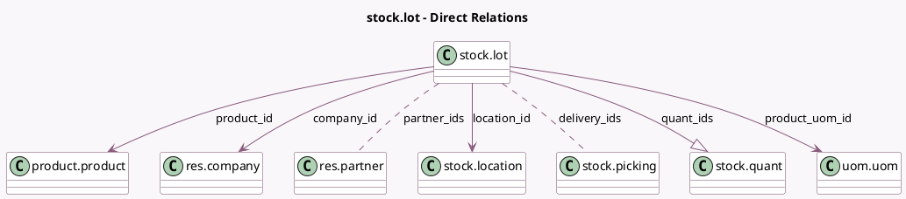

<!-- GENERATED:MODEL -->
---
tags: [odoo, community, generated, model]
---

# stock.lot

- Module: [[docs/Community Addons/stock/stock|stock]]
- Scope: Community Addons
- Defined in module: yes
- Source files: `models/stock_lot.py`
- Python classes: `StockLot`
- Description: Lot/Serial
- Inherits: `mail.activity.mixin`, `mail.thread`

## Field footprint

- Detected fields: 14
- Field types: `Boolean` x 1, `Char` x 2, `Float` x 1, `Html` x 1, `Integer` x 1, `Many2many` x 2, `Many2one` x 4, `One2many` x 1, `Properties` x 1
- Relation fields: 7

## Sample fields

- `company_id`: `Many2one` (comodel `res.company`, compute `_compute_company_id`, store `True`)
- `delivery_count`: `Integer` (comodel `Delivery order count`, compute `_compute_delivery_ids`)
- `delivery_ids`: `Many2many` (comodel `stock.picking`, compute `_compute_delivery_ids`)
- `display_complete`: `Boolean` (compute `_compute_display_complete`)
- `location_id`: `Many2one` (comodel `stock.location`, compute `_compute_single_location`, store `True`)
- `lot_properties`: `Properties` (comodel `Properties`)
- `name`: `Char` (comodel `Lot/Serial Number`, compute `_compute_name`, store `True`)
- `note`: `Html`
- `partner_ids`: `Many2many` (comodel `res.partner`, compute `_compute_partner_ids`)
- `product_id`: `Many2one` (comodel `product.product`)
- `product_qty`: `Float` (comodel `On Hand Quantity`, compute `_product_qty`)
- `product_uom_id`: `Many2one` (comodel `uom.uom`, related `product_id.uom_id`)
- `quant_ids`: `One2many` (comodel `stock.quant`)
- `ref`: `Char` (comodel `Internal Reference`)

## Method hints

- Detected methods: 23
- Action methods: `action_lot_open_quants`, `action_lot_open_transfers`
- Compute methods: `_compute_company_id`, `_compute_delivery_ids`, `_compute_display_complete`, `_compute_name`, `_compute_partner_ids`, `_compute_single_location`
- Onchange methods: none

## Direct relation diagram

## Navigation

- **Parent:** [[docs/Community Addons/stock/Models]]

<!-- GENERATED:MODEL -->
