<!-- GENERATED:MODEL -->
---
tags: [odoo, community, generated, model]
---

# stock.move.line

- Module: [[docs/Community Addons/stock/stock|stock]]
- Scope: Community Addons
- Defined in module: yes
- Source files: `models/stock_move_line.py`
- Python classes: `StockMoveLine`
- Description: Product Moves (Stock Move Line)

## Field footprint

- Detected fields: 44
- Field types: `Boolean` x 7, `Char` x 5, `Datetime` x 2, `Float` x 2, `Many2many` x 3, `Many2one` x 19, `Selection` x 5, `Text` x 1
- Relation fields: 22

## Sample fields

- `allowed_uom_ids`: `Many2many` (comodel `uom.uom`, compute `_compute_allowed_uom_ids`)
- `company_id`: `Many2one` (comodel `res.company`)
- `consume_line_ids`: `Many2many` (comodel `stock.move.line`)
- `date`: `Datetime` (comodel `Date`)
- `description_picking`: `Text` (related `move_id.description_picking`)
- `is_entire_pack`: `Boolean` (comodel `Is added through entire package`)
- `is_inventory`: `Boolean` (related `move_id.is_inventory`)
- `is_locked`: `Boolean` (related `move_id.is_locked`)
- `location_dest_id`: `Many2one` (comodel `stock.location`, compute `_compute_location_id`, store `True`)
- `location_dest_usage`: `Selection` (related `location_dest_id.usage`)
- `location_id`: `Many2one` (comodel `stock.location`, compute `_compute_location_id`, store `True`)
- `location_usage`: `Selection` (related `location_id.usage`)
- `lot_id`: `Many2one` (comodel `stock.lot`)
- `lot_name`: `Char` (comodel `Lot/Serial Number Name`)
- `lots_visible`: `Boolean` (compute `_compute_lots_visible`)
- `move_id`: `Many2one` (comodel `stock.move`)
- `move_partner_id`: `Many2one` (related `move_id.partner_id`)
- `origin`: `Char` (related `move_id.origin`)
- `owner_id`: `Many2one` (comodel `res.partner`)
- `package_history_id`: `Many2one` (comodel `stock.package.history`)

## Method hints

- Detected methods: 50
- Action methods: `action_open_reference`, `action_put_in_pack`, `action_revert_inventory`
- Compute methods: `_compute_allowed_uom_ids`, `_compute_location_id`, `_compute_lots_visible`, `_compute_picked`, `_compute_picking_type_id`, `_compute_product_uom_id`, `_compute_quantity`, `_compute_quantity_product_uom`, and 1 more
- Onchange methods: `_onchange_product_id`, `_onchange_putaway_location`, `_onchange_quantity`, `_onchange_serial_number`

## Direct relation diagram

```plantuml
@startuml
!define ODOO_COLOR_PRIMARY #714B67
!define ODOO_COLOR_ACCENT #875A7B
!define ODOO_COLOR_BG #FAF7FA

skinparam backgroundColor ODOO_COLOR_BG
skinparam defaultTextAlignment left
skinparam ArrowColor ODOO_COLOR_ACCENT
skinparam ClassBackgroundColor white
skinparam ClassBorderColor ODOO_COLOR_PRIMARY
skinparam ComponentBackgroundColor white
skinparam ComponentBorderColor ODOO_COLOR_PRIMARY
skinparam NoteBackgroundColor #FFF8FF
skinparam NoteBorderColor ODOO_COLOR_ACCENT
skinparam SequenceLifeLineBorderColor ODOO_COLOR_ACCENT
skinparam SequenceLifeLineBackgroundColor #FFFFFF
skinparam SequenceParticipantBorderColor ODOO_COLOR_PRIMARY
skinparam SequenceParticipantBackgroundColor #FFFFFF
skinparam sequence {
  ArrowColor ODOO_COLOR_ACCENT
  ActorBorderColor ODOO_COLOR_PRIMARY
}
title stock.move.line - Direct Relations
class "stock.move.line" as stock_move_line
class "product.product" as product_product
class "res.company" as res_company
class "res.partner" as res_partner
class "stock.location" as stock_location
class "stock.lot" as stock_lot
class "stock.move" as stock_move
class "stock.move.line" as stock_move_line
class "stock.package" as stock_package
class "stock.package.history" as stock_package_history
class "stock.picking" as stock_picking
class "stock.picking.type" as stock_picking_type
class "stock.quant" as stock_quant
stock_move_line --> stock_picking : picking_id
stock_move_line --> stock_move : move_id
stock_move_line --> res_company : company_id
stock_move_line --> product_product : product_id
stock_move_line .. uom_uom : allowed_uom_ids
stock_move_line --> uom_uom : product_uom_id
stock_move_line --> stock_package : package_id
stock_move_line --> stock_lot : lot_id
stock_move_line --> stock_package : result_package_id
stock_move_line --> stock_package_history : package_history_id
stock_move_line --> res_partner : owner_id
stock_move_line --> stock_location : location_id
stock_move_line --> stock_location : location_dest_id
stock_move_line --> stock_picking_type : picking_type_id
stock_move_line .. stock_move_line : consume_line_ids
@enduml
```

## Navigation

- **Parent:** [[docs/Community Addons/stock/Models]]

<!-- GENERATED:MODEL -->
