<!-- GENERATED:MODEL -->
---
tags: [odoo, community, generated, model]
---

# stock.move

- Module: [[docs/Community Addons/stock/stock|stock]]
- Scope: Community Addons
- Defined in module: yes
- Source files: `models/stock_move.py`
- Python classes: `StockMove`
- Description: Stock Move

## Field footprint

- Detected fields: 72
- Field types: `Boolean` x 16, `Char` x 4, `Date` x 1, `Datetime` x 4, `Float` x 7, `Integer` x 3, `Json` x 1, `Many2many` x 7, `Many2one` x 17, `One2many` x 3, `Selection` x 7, `Text` x 2
- Relation fields: 27

## Sample fields

- `additional`: `Boolean` (comodel `Whether the move was added after the picking's confirmation`)
- `allowed_uom_ids`: `Many2many` (comodel `uom.uom`, compute `_compute_allowed_uom_ids`)
- `availability`: `Float` (comodel `Forecasted Quantity`, compute `_compute_product_availability`)
- `company_id`: `Many2one` (comodel `res.company`)
- `date`: `Datetime` (comodel `Date Scheduled`)
- `date_deadline`: `Datetime` (comodel `Deadline`)
- `delay_alert_date`: `Datetime` (comodel `Delay Alert Date`, compute `_compute_delay_alert_date`, store `True`)
- `description_picking`: `Text` (compute `_compute_description_picking`)
- `description_picking_manual`: `Text`
- `display_assign_serial`: `Boolean` (compute `_compute_display_assign_serial`)
- `display_import_lot`: `Boolean` (compute `_compute_display_assign_serial`)
- `forecast_availability`: `Float` (comodel `Forecast Availability`, compute `_compute_forecast_information`)
- `forecast_expected_date`: `Datetime` (comodel `Forecasted Expected date`, compute `_compute_forecast_information`)
- `has_lines_without_result_package`: `Boolean` (compute `_compute_has_lines_without_result_package`)
- `has_tracking`: `Selection` (related `product_id.tracking`)
- `inventory_name`: `Char`
- `is_initial_demand_editable`: `Boolean` (comodel `Is initial demand editable`, compute `_compute_is_initial_demand_editable`)
- `is_inventory`: `Boolean` (comodel `Inventory`)
- `is_locked`: `Boolean` (compute `_compute_is_locked`)
- `is_quantity_done_editable`: `Boolean` (comodel `Is quantity done editable`, compute `_compute_is_quantity_done_editable`)

## Method hints

- Detected methods: 125
- Action methods: `action_add_packages`, `action_generate_lot_line_vals`, `action_open_reference`, `action_product_forecast_report`, `action_show_details`
- Compute methods: `_compute_allowed_uom_ids`, `_compute_delay_alert_date`, `_compute_description_picking`, `_compute_display_assign_serial`, `_compute_display_name`, `_compute_forecast_information`, `_compute_has_lines_without_result_package`, `_compute_is_initial_demand_editable`, and 21 more
- Onchange methods: `_onchange_lot_ids`

## Direct relation diagram

```plantuml
@startuml
!define ODOO_COLOR_PRIMARY #714B67
!define ODOO_COLOR_ACCENT #875A7B
!define ODOO_COLOR_BG #FAF7FA

skinparam backgroundColor ODOO_COLOR_BG
skinparam defaultTextAlignment left
skinparam ArrowColor ODOO_COLOR_ACCENT
skinparam ClassBackgroundColor white
skinparam ClassBorderColor ODOO_COLOR_PRIMARY
skinparam ComponentBackgroundColor white
skinparam ComponentBorderColor ODOO_COLOR_PRIMARY
skinparam NoteBackgroundColor #FFF8FF
skinparam NoteBorderColor ODOO_COLOR_ACCENT
skinparam SequenceLifeLineBorderColor ODOO_COLOR_ACCENT
skinparam SequenceLifeLineBackgroundColor #FFFFFF
skinparam SequenceParticipantBorderColor ODOO_COLOR_PRIMARY
skinparam SequenceParticipantBackgroundColor #FFFFFF
skinparam sequence {
  ArrowColor ODOO_COLOR_ACCENT
  ActorBorderColor ODOO_COLOR_PRIMARY
}
title stock.move - Direct Relations
class "stock.move" as stock_move
class "product.product" as product_product
class "product.template" as product_template
class "product.template.attribute.value" as product_template_attribute_value
class "res.company" as res_company
class "res.partner" as res_partner
class "stock.location" as stock_location
class "stock.lot" as stock_lot
class "stock.move" as stock_move
class "stock.move.line" as stock_move_line
class "stock.package" as stock_package
class "stock.picking" as stock_picking
class "stock.picking.type" as stock_picking_type
stock_move --> res_company : company_id
stock_move --> product_product : product_id
stock_move .. product_template_attribute_value : never_product_template_attribute_value_ids
stock_move .. uom_uom : allowed_uom_ids
stock_move --> uom_uom : product_uom
stock_move --> product_template : product_tmpl_id
stock_move --> stock_location : location_id
stock_move --> stock_location : location_dest_id
stock_move --> stock_location : location_final_id
stock_move --> res_partner : partner_id
stock_move .. stock_move : move_dest_ids
stock_move .. stock_move : move_orig_ids
stock_move --> stock_picking : picking_id
stock_move --> stock_scrap : scrap_id
stock_move .. stock_reference : reference_ids
stock_move --> stock_rule : rule_id
stock_move --> stock_picking_type : picking_type_id
stock_move --|> stock_move_line : move_line_ids
@enduml
```

## Navigation

- **Parent:** [[docs/Community Addons/stock/Models]]

<!-- GENERATED:MODEL -->
