<!-- GENERATED:MODEL -->
---
tags: [odoo, community, generated, model]
---

# stock.orderpoint.snooze

- Module: [[docs/Community Addons/stock/stock|stock]]
- Scope: Community Addons
- Defined in module: yes
- Source files: `wizard/stock_orderpoint_snooze.py`
- Python classes: `StockOrderpointSnooze`
- Description: Snooze Orderpoint

## Field footprint

- Detected fields: 3
- Field types: `Date` x 1, `Many2many` x 1, `Selection` x 1
- Relation fields: 1

## Sample fields

- `orderpoint_ids`: `Many2many` (comodel `stock.warehouse.orderpoint`)
- `predefined_date`: `Selection`
- `snoozed_until`: `Date` (comodel `Snooze Date`)

## Method hints

- Detected methods: 2
- Action methods: `action_snooze`
- Compute methods: none
- Onchange methods: `_onchange_predefined_date`

## Direct relation diagram

```plantuml
@startuml
!define ODOO_COLOR_PRIMARY #714B67
!define ODOO_COLOR_ACCENT #875A7B
!define ODOO_COLOR_BG #FAF7FA

skinparam backgroundColor ODOO_COLOR_BG
skinparam defaultTextAlignment left
skinparam ArrowColor ODOO_COLOR_ACCENT
skinparam ClassBackgroundColor white
skinparam ClassBorderColor ODOO_COLOR_PRIMARY
skinparam ComponentBackgroundColor white
skinparam ComponentBorderColor ODOO_COLOR_PRIMARY
skinparam NoteBackgroundColor #FFF8FF
skinparam NoteBorderColor ODOO_COLOR_ACCENT
skinparam SequenceLifeLineBorderColor ODOO_COLOR_ACCENT
skinparam SequenceLifeLineBackgroundColor #FFFFFF
skinparam SequenceParticipantBorderColor ODOO_COLOR_PRIMARY
skinparam SequenceParticipantBackgroundColor #FFFFFF
skinparam sequence {
  ArrowColor ODOO_COLOR_ACCENT
  ActorBorderColor ODOO_COLOR_PRIMARY
}
title stock.orderpoint.snooze - Direct Relations
class "stock.orderpoint.snooze" as stock_orderpoint_snooze
class "stock.warehouse.orderpoint" as stock_warehouse_orderpoint
stock_orderpoint_snooze .. stock_warehouse_orderpoint : orderpoint_ids
@enduml
```

## Navigation

- **Parent:** [[docs/Community Addons/stock/Models]]

<!-- GENERATED:MODEL -->
