<!-- GENERATED:MODEL -->
---
tags: [odoo, community, generated, model]
---

# stock.package.destination

- Module: [[docs/Community Addons/stock/stock|stock]]
- Scope: Community Addons
- Defined in module: yes
- Source files: `wizard/stock_package_destination.py`
- Python classes: `StockPackageDestination`
- Description: Stock Package Destination

## Field footprint

- Detected fields: 3
- Field types: `Many2many` x 1, `Many2one` x 1, `One2many` x 1
- Relation fields: 3

## Sample fields

- `filtered_location`: `One2many` (comodel `stock.location`, compute `_compute_filtered_location`)
- `location_dest_id`: `Many2one` (comodel `stock.location`)
- `move_line_ids`: `Many2many` (comodel `stock.move.line`)

## Method hints

- Detected methods: 2
- Action methods: `action_done`
- Compute methods: `_compute_filtered_location`
- Onchange methods: none

## Direct relation diagram

```plantuml
@startuml
!define ODOO_COLOR_PRIMARY #714B67
!define ODOO_COLOR_ACCENT #875A7B
!define ODOO_COLOR_BG #FAF7FA

skinparam backgroundColor ODOO_COLOR_BG
skinparam defaultTextAlignment left
skinparam ArrowColor ODOO_COLOR_ACCENT
skinparam ClassBackgroundColor white
skinparam ClassBorderColor ODOO_COLOR_PRIMARY
skinparam ComponentBackgroundColor white
skinparam ComponentBorderColor ODOO_COLOR_PRIMARY
skinparam NoteBackgroundColor #FFF8FF
skinparam NoteBorderColor ODOO_COLOR_ACCENT
skinparam SequenceLifeLineBorderColor ODOO_COLOR_ACCENT
skinparam SequenceLifeLineBackgroundColor #FFFFFF
skinparam SequenceParticipantBorderColor ODOO_COLOR_PRIMARY
skinparam SequenceParticipantBackgroundColor #FFFFFF
skinparam sequence {
  ArrowColor ODOO_COLOR_ACCENT
  ActorBorderColor ODOO_COLOR_PRIMARY
}
title stock.package.destination - Direct Relations
class "stock.package.destination" as stock_package_destination
class "stock.location" as stock_location
class "stock.move.line" as stock_move_line
stock_package_destination .. stock_move_line : move_line_ids
stock_package_destination --> stock_location : location_dest_id
stock_package_destination --|> stock_location : filtered_location
@enduml
```

## Navigation

- **Parent:** [[docs/Community Addons/stock/Models]]

<!-- GENERATED:MODEL -->
