<!-- GENERATED:MODEL -->
---
tags: [odoo, community, generated, model]
---

# stock.package.history

- Module: [[docs/Community Addons/stock/stock|stock]]
- Scope: Community Addons
- Defined in module: yes
- Source files: `models/stock_package_history.py`
- Python classes: `StockPackageHistory`
- Description: Stock Package History

## Field footprint

- Detected fields: 13
- Field types: `Char` x 3, `Many2many` x 1, `Many2one` x 8, `One2many` x 1
- Relation fields: 10

## Sample fields

- `company_id`: `Many2one` (comodel `res.company`)
- `location_dest_id`: `Many2one` (comodel `stock.location`)
- `location_id`: `Many2one` (comodel `stock.location`)
- `move_line_ids`: `One2many` (comodel `stock.move.line`)
- `outermost_dest_id`: `Many2one` (comodel `stock.package`)
- `package_id`: `Many2one` (comodel `stock.package`)
- `package_name`: `Char` (comodel `Package Name`)
- `package_type_id`: `Many2one` (comodel `stock.package.type`, related `package_id.package_type_id`)
- `parent_dest_id`: `Many2one` (comodel `stock.package`)
- `parent_dest_name`: `Char` (comodel `Destination Container Name`)
- `parent_orig_id`: `Many2one` (comodel `stock.package`)
- `parent_orig_name`: `Char` (comodel `Origin Container Name`)
- `picking_ids`: `Many2many` (comodel `stock.picking`)

## Method hints

- Detected methods: 1
- Action methods: none
- Compute methods: none
- Onchange methods: none

## Direct relation diagram

```plantuml
@startuml
!define ODOO_COLOR_PRIMARY #714B67
!define ODOO_COLOR_ACCENT #875A7B
!define ODOO_COLOR_BG #FAF7FA

skinparam backgroundColor ODOO_COLOR_BG
skinparam defaultTextAlignment left
skinparam ArrowColor ODOO_COLOR_ACCENT
skinparam ClassBackgroundColor white
skinparam ClassBorderColor ODOO_COLOR_PRIMARY
skinparam ComponentBackgroundColor white
skinparam ComponentBorderColor ODOO_COLOR_PRIMARY
skinparam NoteBackgroundColor #FFF8FF
skinparam NoteBorderColor ODOO_COLOR_ACCENT
skinparam SequenceLifeLineBorderColor ODOO_COLOR_ACCENT
skinparam SequenceLifeLineBackgroundColor #FFFFFF
skinparam SequenceParticipantBorderColor ODOO_COLOR_PRIMARY
skinparam SequenceParticipantBackgroundColor #FFFFFF
skinparam sequence {
  ArrowColor ODOO_COLOR_ACCENT
  ActorBorderColor ODOO_COLOR_PRIMARY
}
title stock.package.history - Direct Relations
class "stock.package.history" as stock_package_history
class "res.company" as res_company
class "stock.location" as stock_location
class "stock.move.line" as stock_move_line
class "stock.package" as stock_package
class "stock.package.type" as stock_package_type
class "stock.picking" as stock_picking
stock_package_history --> res_company : company_id
stock_package_history --> stock_location : location_id
stock_package_history --> stock_location : location_dest_id
stock_package_history --|> stock_move_line : move_line_ids
stock_package_history --> stock_package : package_id
stock_package_history --> stock_package_type : package_type_id
stock_package_history --> stock_package : parent_orig_id
stock_package_history --> stock_package : parent_dest_id
stock_package_history --> stock_package : outermost_dest_id
stock_package_history .. stock_picking : picking_ids
@enduml
```

## Navigation

- **Parent:** [[docs/Community Addons/stock/Models]]

<!-- GENERATED:MODEL -->
