<!-- GENERATED:MODEL -->
---
tags: [odoo, community, generated, model]
---

# stock.package

- Module: [[docs/Community Addons/stock/stock|stock]]
- Scope: Community Addons
- Defined in module: yes
- Source files: `models/stock_package.py`
- Python classes: `StockPackage`
- Description: Package

## Field footprint

- Detected fields: 24
- Field types: `Boolean` x 1, `Char` x 6, `Date` x 1, `Float` x 1, `Many2many` x 1, `Many2one` x 8, `One2many` x 6
- Relation fields: 15

## Sample fields

- `all_children_package_ids`: `One2many` (comodel `stock.package`, compute `_compute_all_children_package_ids`)
- `child_package_dest_ids`: `One2many` (comodel `stock.package`)
- `child_package_ids`: `One2many` (comodel `stock.package`)
- `company_id`: `Many2one` (comodel `res.company`, compute `_compute_package_info`, store `True`)
- `complete_name`: `Char` (comodel `Full Package Name`, compute `_compute_complete_name`, store `True`)
- `contained_quant_ids`: `One2many` (comodel `stock.quant`, compute `_compute_contained_quant_ids`)
- `content_description`: `Char` (comodel `Contents`, compute `_compute_content_description`)
- `dest_complete_name`: `Char` (comodel `Package Name At Destination`, compute `_compute_dest_complete_name`)
- `json_popover`: `Char` (comodel `JSON data for popover widget`, compute `_compute_json_popover`)
- `location_dest_id`: `Many2one` (comodel `stock.location`, compute `_compute_location_dest_id`)
- `location_id`: `Many2one` (comodel `stock.location`, compute `_compute_package_info`, store `True`)
- `move_line_ids`: `One2many` (comodel `stock.move.line`, compute `_compute_move_line_ids`)
- `name`: `Char` (comodel `Package Reference`)
- `outermost_package_id`: `Many2one` (comodel `stock.package`, compute `_compute_outermost_package_id`)
- `owner_id`: `Many2one` (comodel `res.partner`, compute `_compute_owner_id`)
- `pack_date`: `Date` (comodel `Pack Date`)
- `package_dest_id`: `Many2one` (comodel `stock.package`)
- `package_type_id`: `Many2one` (comodel `stock.package.type`)
- `parent_package_id`: `Many2one` (comodel `stock.package`)
- `parent_path`: `Char`

## Method hints

- Detected methods: 37
- Action methods: `action_add_to_picking`, `action_put_in_pack`, `action_remove_package`, `action_view_picking`
- Compute methods: `_compute_all_children_package_ids`, `_compute_complete_name`, `_compute_contained_quant_ids`, `_compute_content_description`, `_compute_dest_complete_name`, `_compute_display_name`, `_compute_json_popover`, `_compute_location_dest_id`, and 6 more
- Onchange methods: none

## Direct relation diagram

```plantuml
@startuml
!define ODOO_COLOR_PRIMARY #714B67
!define ODOO_COLOR_ACCENT #875A7B
!define ODOO_COLOR_BG #FAF7FA

skinparam backgroundColor ODOO_COLOR_BG
skinparam defaultTextAlignment left
skinparam ArrowColor ODOO_COLOR_ACCENT
skinparam ClassBackgroundColor white
skinparam ClassBorderColor ODOO_COLOR_PRIMARY
skinparam ComponentBackgroundColor white
skinparam ComponentBorderColor ODOO_COLOR_PRIMARY
skinparam NoteBackgroundColor #FFF8FF
skinparam NoteBorderColor ODOO_COLOR_ACCENT
skinparam SequenceLifeLineBorderColor ODOO_COLOR_ACCENT
skinparam SequenceLifeLineBackgroundColor #FFFFFF
skinparam SequenceParticipantBorderColor ODOO_COLOR_PRIMARY
skinparam SequenceParticipantBackgroundColor #FFFFFF
skinparam sequence {
  ArrowColor ODOO_COLOR_ACCENT
  ActorBorderColor ODOO_COLOR_PRIMARY
}
title stock.package - Direct Relations
class "stock.package" as stock_package
class "res.company" as res_company
class "res.partner" as res_partner
class "stock.location" as stock_location
class "stock.move.line" as stock_move_line
class "stock.package" as stock_package
class "stock.package.type" as stock_package_type
class "stock.picking" as stock_picking
class "stock.quant" as stock_quant
stock_package --|> stock_quant : quant_ids
stock_package --|> stock_quant : contained_quant_ids
stock_package --> stock_package_type : package_type_id
stock_package --> stock_location : location_id
stock_package --> stock_location : location_dest_id
stock_package --> res_company : company_id
stock_package --> res_partner : owner_id
stock_package --> stock_package : parent_package_id
stock_package --|> stock_package : child_package_ids
stock_package --|> stock_package : all_children_package_ids
stock_package --> stock_package : package_dest_id
stock_package --> stock_package : outermost_package_id
stock_package --|> stock_package : child_package_dest_ids
stock_package --|> stock_move_line : move_line_ids
stock_package .. stock_picking : picking_ids
@enduml
```

## Navigation

- **Parent:** [[docs/Community Addons/stock/Models]]

<!-- GENERATED:MODEL -->
