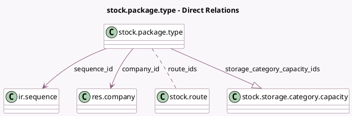

<!-- GENERATED:MODEL -->
---
tags: [odoo, community, generated, model]
---

# stock.package.type

- Module: [[docs/Community Addons/stock/stock|stock]]
- Scope: Community Addons
- Defined in module: yes
- Source files: `models/stock_package_type.py`
- Python classes: `StockPackageType`
- Description: Stock package type

## Field footprint

- Detected fields: 17
- Field types: `Boolean` x 1, `Char` x 5, `Float` x 5, `Integer` x 1, `Many2many` x 1, `Many2one` x 2, `One2many` x 1, `Selection` x 1
- Relation fields: 4

## Sample fields

- `barcode`: `Char` (comodel `Barcode`)
- `base_weight`: `Float`
- `company_id`: `Many2one` (comodel `res.company`)
- `has_quants`: `Boolean` (comodel `Has Contents`, compute `_compute_has_quants`)
- `height`: `Float` (comodel `Height`)
- `length_uom_name`: `Char` (compute `_compute_length_uom_name`)
- `max_weight`: `Float` (comodel `Max Weight`)
- `name`: `Char` (comodel `Package Type`)
- `package_use`: `Selection`
- `packaging_length`: `Float` (comodel `Length`)
- `route_ids`: `Many2many` (comodel `stock.route`)
- `sequence`: `Integer` (comodel `Sequence`)
- `sequence_code`: `Char` (comodel `Sequence Prefix`, related `sequence_id.code`)
- `sequence_id`: `Many2one` (comodel `ir.sequence`)
- `storage_category_capacity_ids`: `One2many` (comodel `stock.storage.category.capacity`)
- `weight_uom_name`: `Char` (compute `_compute_weight_uom_name`)
- `width`: `Float` (comodel `Width`)

## Method hints

- Detected methods: 10
- Action methods: none
- Compute methods: `_compute_display_name`, `_compute_has_quants`, `_compute_length_uom_name`, `_compute_weight_uom_name`
- Onchange methods: none

## Direct relation diagram

## Navigation

- **Parent:** [[docs/Community Addons/stock/Models]]

<!-- GENERATED:MODEL -->
