<!-- GENERATED:MODEL -->
---
tags: [odoo, community, generated, model]
---

# stock.picking

- Module: [[docs/Community Addons/stock/stock|stock]]
- Scope: Community Addons
- Defined in module: yes
- Source files: `models/stock_picking.py`
- Python classes: `StockPicking`
- Description: Transfer
- Inherits: `mail.activity.mixin`, `mail.thread`

## Field footprint

- Detected fields: 56
- Field types: `Boolean` x 14, `Char` x 4, `Datetime` x 4, `Float` x 3, `Html` x 1, `Image` x 1, `Integer` x 2, `Many2many` x 2, `Many2one` x 13, `One2many` x 4, `Properties` x 1, `Selection` x 6, `Text` x 1
- Relation fields: 19

## Sample fields

- `backorder_id`: `Many2one` (comodel `stock.picking`)
- `backorder_ids`: `One2many` (comodel `stock.picking`)
- `company_id`: `Many2one` (comodel `res.company`, related `picking_type_id.company_id`, store `True`)
- `date_deadline`: `Datetime` (comodel `Deadline`, compute `_compute_date_deadline`, store `True`)
- `date_done`: `Datetime` (comodel `Date of Transfer`)
- `delay_alert_date`: `Datetime` (comodel `Delay Alert Date`, compute `_compute_delay_alert_date`)
- `has_deadline_issue`: `Boolean` (comodel `Is late`, compute `_compute_has_deadline_issue`, store `True`)
- `has_scrap_move`: `Boolean` (comodel `Has Scrap Moves`, compute `_has_scrap_move`)
- `has_tracking`: `Boolean` (compute `_compute_has_tracking`)
- `is_locked`: `Boolean`
- `is_signed`: `Boolean` (comodel `Is Signed`, compute `_compute_is_signed`)
- `json_popover`: `Char` (comodel `JSON data for the popover widget`, compute `_compute_json_popover`)
- `location_dest_id`: `Many2one` (comodel `stock.location`, compute `_compute_location_id`, store `True`)
- `location_id`: `Many2one` (comodel `stock.location`, compute `_compute_location_id`, store `True`)
- `lot_id`: `Many2one` (comodel `stock.lot`, related `move_line_ids.lot_id`)
- `move_ids`: `One2many` (comodel `stock.move`)
- `move_line_ids`: `One2many` (comodel `stock.move.line`)
- `move_type`: `Selection` (compute `_compute_move_type`, store `True`)
- `name`: `Char` (comodel `Reference`)
- `note`: `Html` (comodel `Notes`)

## Method hints

- Detected methods: 93
- Action methods: `action_add_entire_packs`, `action_assign`, `action_cancel`, `action_confirm`, `action_detailed_operations`, `action_next_transfer`, `action_open_label_layout`, `action_open_label_type`, and 9 more
- Compute methods: `_compute_bulk_weight`, `_compute_date_deadline`, `_compute_delay_alert_date`, `_compute_has_deadline_issue`, `_compute_has_tracking`, `_compute_is_signed`, `_compute_json_popover`, `_compute_location_id`, and 13 more
- Onchange methods: `_onchange_location_id`, `_onchange_picking_type`

## Direct relation diagram

```plantuml
@startuml
!define ODOO_COLOR_PRIMARY #714B67
!define ODOO_COLOR_ACCENT #875A7B
!define ODOO_COLOR_BG #FAF7FA

skinparam backgroundColor ODOO_COLOR_BG
skinparam defaultTextAlignment left
skinparam ArrowColor ODOO_COLOR_ACCENT
skinparam ClassBackgroundColor white
skinparam ClassBorderColor ODOO_COLOR_PRIMARY
skinparam ComponentBackgroundColor white
skinparam ComponentBorderColor ODOO_COLOR_PRIMARY
skinparam NoteBackgroundColor #FFF8FF
skinparam NoteBorderColor ODOO_COLOR_ACCENT
skinparam SequenceLifeLineBorderColor ODOO_COLOR_ACCENT
skinparam SequenceLifeLineBackgroundColor #FFFFFF
skinparam SequenceParticipantBorderColor ODOO_COLOR_PRIMARY
skinparam SequenceParticipantBackgroundColor #FFFFFF
skinparam sequence {
  ArrowColor ODOO_COLOR_ACCENT
  ActorBorderColor ODOO_COLOR_PRIMARY
}
title stock.picking - Direct Relations
class "stock.picking" as stock_picking
class "product.product" as product_product
class "res.company" as res_company
class "res.country" as res_country
class "res.partner" as res_partner
class "res.users" as res_users
class "stock.location" as stock_location
class "stock.lot" as stock_lot
class "stock.move" as stock_move
class "stock.move.line" as stock_move_line
class "stock.package.history" as stock_package_history
class "stock.picking" as stock_picking
class "stock.picking.type" as stock_picking_type
stock_picking --> stock_picking : backorder_id
stock_picking --|> stock_picking : backorder_ids
stock_picking --> stock_picking : return_id
stock_picking --|> stock_picking : return_ids
stock_picking .. stock_reference : reference_ids
stock_picking --> stock_location : location_id
stock_picking --> stock_location : location_dest_id
stock_picking --|> stock_move : move_ids
stock_picking --> stock_picking_type : picking_type_id
stock_picking --> res_partner : warehouse_address_id
stock_picking --> res_partner : partner_id
stock_picking --> res_company : company_id
stock_picking --> res_users : user_id
stock_picking --|> stock_move_line : move_line_ids
stock_picking .. stock_package_history : package_history_ids
stock_picking --> res_partner : owner_id
stock_picking --> product_product : product_id
stock_picking --> stock_lot : lot_id
@enduml
```

## Navigation

- **Parent:** [[docs/Community Addons/stock/Models]]

<!-- GENERATED:MODEL -->
