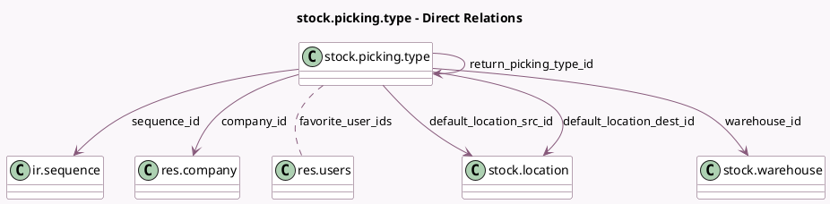

<!-- GENERATED:MODEL -->
---
tags: [odoo, community, generated, model]
---

# stock.picking.type

- Module: [[docs/Community Addons/stock/stock|stock]]
- Scope: Community Addons
- Defined in module: yes
- Source files: `models/stock_picking.py`
- Python classes: `StockPickingType`
- Description: Picking Type

## Field footprint

- Detected fields: 49
- Field types: `Boolean` x 19, `Char` x 3, `Integer` x 11, `Many2many` x 1, `Many2one` x 6, `PropertiesDefinition` x 1, `Selection` x 7, `Text` x 1
- Relation fields: 7

## Sample fields

- `active`: `Boolean` (comodel `Active`)
- `auto_print_delivery_slip`: `Boolean` (comodel `Auto Print Delivery Slip`)
- `auto_print_lot_labels`: `Boolean` (comodel `Auto Print Lot/SN Labels`)
- `auto_print_package_label`: `Boolean` (comodel `Auto Print Package Label`)
- `auto_print_packages`: `Boolean` (comodel `Auto Print Packages`)
- `auto_print_product_labels`: `Boolean` (comodel `Auto Print Product Labels`)
- `auto_print_reception_report`: `Boolean` (comodel `Auto Print Reception Report`)
- `auto_print_reception_report_labels`: `Boolean` (comodel `Auto Print Reception Report Labels`)
- `auto_print_return_slip`: `Boolean` (comodel `Auto Print Return Slip`)
- `auto_show_reception_report`: `Boolean` (comodel `Show Reception Report at Validation`)
- `barcode`: `Char` (comodel `Barcode`)
- `code`: `Selection`
- `color`: `Integer` (comodel `Color`)
- `company_id`: `Many2one` (comodel `res.company`)
- `count_move_ready`: `Integer` (compute `_compute_move_count`)
- `count_picking`: `Integer` (compute `_compute_picking_count`)
- `count_picking_backorders`: `Integer` (compute `_compute_picking_count`)
- `count_picking_draft`: `Integer` (compute `_compute_picking_count`)
- `count_picking_late`: `Integer` (compute `_compute_picking_count`)
- `count_picking_ready`: `Integer` (compute `_compute_picking_count`)

## Method hints

- Detected methods: 34
- Action methods: `action_redirect_to_barcode_installation`
- Compute methods: `_compute_default_location_dest_id`, `_compute_default_location_src_id`, `_compute_display_name`, `_compute_hide_reservation_method`, `_compute_is_favorite`, `_compute_kanban_dashboard_graph`, `_compute_move_count`, `_compute_picking_count`, and 5 more
- Onchange methods: `_onchange_picking_code`, `_onchange_sequence_code`

## Direct relation diagram

## Navigation

- **Parent:** [[docs/Community Addons/stock/Models]]

<!-- GENERATED:MODEL -->
