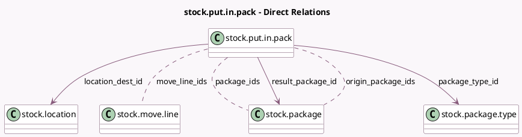

<!-- GENERATED:MODEL -->
---
tags: [odoo, community, generated, model]
---

# stock.put.in.pack

- Module: [[docs/Community Addons/stock/stock|stock]]
- Scope: Community Addons
- Defined in module: yes
- Source files: `wizard/stock_put_in_pack.py`
- Python classes: `StockPutInPack`
- Description: Put In Pack Wizard

## Field footprint

- Detected fields: 7
- Field types: `Many2many` x 3, `Many2one` x 4
- Relation fields: 7

## Sample fields

- `location_dest_id`: `Many2one` (comodel `stock.location`)
- `move_line_ids`: `Many2many` (comodel `stock.move.line`)
- `origin_package_ids`: `Many2many` (comodel `stock.package`, compute `_compute_origin_package_ids`)
- `package_ids`: `Many2many` (comodel `stock.package`)
- `package_type_id`: `Many2one` (comodel `stock.package.type`)
- `package_type_sequence_id`: `Many2one` (related `package_type_id.sequence_id`)
- `result_package_id`: `Many2one` (comodel `stock.package`)

## Method hints

- Detected methods: 4
- Action methods: `action_put_in_pack`
- Compute methods: `_compute_origin_package_ids`
- Onchange methods: `_onchange_package_type_id`

## Direct relation diagram

## Navigation

- **Parent:** [[docs/Community Addons/stock/Models]]

<!-- GENERATED:MODEL -->
