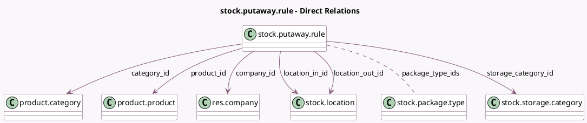

<!-- GENERATED:MODEL -->
---
tags: [odoo, community, generated, model]
---

# stock.putaway.rule

- Module: [[docs/Community Addons/stock/stock|stock]]
- Scope: Community Addons
- Defined in module: yes
- Source files: `models/product_strategy.py`
- Python classes: `StockPutawayRule`
- Description: Putaway Rule

## Field footprint

- Detected fields: 10
- Field types: `Boolean` x 1, `Integer` x 1, `Many2many` x 1, `Many2one` x 6, `Selection` x 1
- Relation fields: 7

## Sample fields

- `active`: `Boolean` (comodel `Active`)
- `category_id`: `Many2one` (comodel `product.category`)
- `company_id`: `Many2one` (comodel `res.company`)
- `location_in_id`: `Many2one` (comodel `stock.location`)
- `location_out_id`: `Many2one` (comodel `stock.location`)
- `package_type_ids`: `Many2many` (comodel `stock.package.type`)
- `product_id`: `Many2one` (comodel `product.product`)
- `sequence`: `Integer` (comodel `Priority`)
- `storage_category_id`: `Many2one` (comodel `stock.storage.category`, compute `_compute_storage_category`, store `True`)
- `sublocation`: `Selection`

## Method hints

- Detected methods: 11
- Action methods: none
- Compute methods: `_compute_storage_category`
- Onchange methods: `_onchange_location_in`, `_onchange_sublocation`

## Direct relation diagram

## Navigation

- **Parent:** [[docs/Community Addons/stock/Models]]

<!-- GENERATED:MODEL -->
