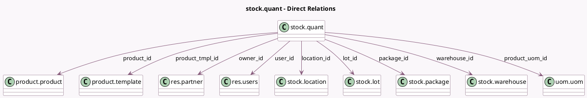

<!-- GENERATED:MODEL -->
---
tags: [odoo, community, generated, model]
---

# stock.quant

- Module: [[docs/Community Addons/stock/stock|stock]]
- Scope: Community Addons
- Defined in module: yes
- Source files: `models/stock_quant.py`
- Python classes: `StockQuant`
- Description: Quants

## Field footprint

- Detected fields: 29
- Field types: `Boolean` x 5, `Date` x 2, `Datetime` x 1, `Float` x 6, `Integer` x 1, `Many2one` x 12, `Properties` x 1, `Selection` x 1
- Relation fields: 12

## Sample fields

- `available_quantity`: `Float` (comodel `Available Quantity`, compute `_compute_available_quantity`)
- `company_id`: `Many2one` (related `location_id.company_id`, store `True`)
- `cyclic_inventory_frequency`: `Integer` (related `location_id.cyclic_inventory_frequency`)
- `in_date`: `Datetime` (comodel `Incoming Date`)
- `inventory_date`: `Date` (comodel `Scheduled`, compute `_compute_inventory_date`, store `True`)
- `inventory_diff_quantity`: `Float` (comodel `Difference`, compute `_compute_inventory_diff_quantity`, store `True`)
- `inventory_quantity`: `Float` (comodel `Counted`)
- `inventory_quantity_auto_apply`: `Float` (comodel `Inventoried Quantity`, compute `_compute_inventory_quantity_auto_apply`)
- `inventory_quantity_set`: `Boolean` (compute `_compute_inventory_quantity_set`, store `True`)
- `is_favorite`: `Boolean` (related `product_tmpl_id.is_favorite`)
- `is_outdated`: `Boolean` (comodel `Quantity has been moved since last count`, compute `_compute_is_outdated`)
- `last_count_date`: `Date` (compute `_compute_last_count_date`)
- `location_id`: `Many2one` (comodel `stock.location`)
- `lot_id`: `Many2one` (comodel `stock.lot`)
- `lot_properties`: `Properties` (related `lot_id.lot_properties`)
- `on_hand`: `Boolean` (comodel `On Hand`, store `False`)
- `owner_id`: `Many2one` (comodel `res.partner`)
- `package_id`: `Many2one` (comodel `stock.package`)
- `product_categ_id`: `Many2one` (related `product_tmpl_id.categ_id`)
- `product_id`: `Many2one` (comodel `product.product`)

## Method hints

- Detected methods: 71
- Action methods: `action_apply_all`, `action_apply_inventory`, `action_clear_inventory_quantity`, `action_inventory_history`, `action_reset`, `action_set_inventory_quantity`, `action_set_inventory_quantity_zero`, `action_stock_quant_relocate`, and 4 more
- Compute methods: `_compute_available_quantity`, `_compute_display_name`, `_compute_inventory_date`, `_compute_inventory_diff_quantity`, `_compute_inventory_quantity_auto_apply`, `_compute_inventory_quantity_set`, `_compute_is_outdated`, `_compute_last_count_date`, and 1 more
- Onchange methods: `_onchange_inventory_quantity`, `_onchange_location_or_product_id`, `_onchange_product_id`, `_onchange_serial_number`

## Direct relation diagram

## Navigation

- **Parent:** [[docs/Community Addons/stock/Models]]

<!-- GENERATED:MODEL -->
