<!-- GENERATED:MODEL -->
---
tags: [odoo, community, generated, model]
---

# stock.quant.relocate

- Module: [[docs/Community Addons/stock/stock|stock]]
- Scope: Community Addons
- Defined in module: yes
- Source files: `wizard/stock_quant_relocate.py`
- Python classes: `StockQuantRelocate`
- Description: Stock Quantity Relocation

## Field footprint

- Detected fields: 9
- Field types: `Boolean` x 2, `Char` x 2, `Many2many` x 1, `Many2one` x 3, `Text` x 1
- Relation fields: 4

## Sample fields

- `company_id`: `Many2one` (related `quant_ids.company_id`)
- `dest_location_id`: `Many2one` (comodel `stock.location`)
- `dest_package_id`: `Many2one` (comodel `stock.package`, compute `_compute_dest_package_id`, store `True`)
- `dest_package_id_domain`: `Char` (compute `_compute_dest_package_id_domain`)
- `is_multi_location`: `Boolean` (compute `_compute_is_multi_location`)
- `is_partial_package`: `Boolean` (compute `_compute_is_partial_package`)
- `message`: `Text` (comodel `Reason for relocation`)
- `partial_package_names`: `Char` (compute `_compute_is_partial_package`)
- `quant_ids`: `Many2many` (comodel `stock.quant`)

## Method hints

- Detected methods: 5
- Action methods: `action_relocate_quants`
- Compute methods: `_compute_dest_package_id`, `_compute_dest_package_id_domain`, `_compute_is_multi_location`, `_compute_is_partial_package`
- Onchange methods: none

## Direct relation diagram

```plantuml
@startuml
!define ODOO_COLOR_PRIMARY #714B67
!define ODOO_COLOR_ACCENT #875A7B
!define ODOO_COLOR_BG #FAF7FA

skinparam backgroundColor ODOO_COLOR_BG
skinparam defaultTextAlignment left
skinparam ArrowColor ODOO_COLOR_ACCENT
skinparam ClassBackgroundColor white
skinparam ClassBorderColor ODOO_COLOR_PRIMARY
skinparam ComponentBackgroundColor white
skinparam ComponentBorderColor ODOO_COLOR_PRIMARY
skinparam NoteBackgroundColor #FFF8FF
skinparam NoteBorderColor ODOO_COLOR_ACCENT
skinparam SequenceLifeLineBorderColor ODOO_COLOR_ACCENT
skinparam SequenceLifeLineBackgroundColor #FFFFFF
skinparam SequenceParticipantBorderColor ODOO_COLOR_PRIMARY
skinparam SequenceParticipantBackgroundColor #FFFFFF
skinparam sequence {
  ArrowColor ODOO_COLOR_ACCENT
  ActorBorderColor ODOO_COLOR_PRIMARY
}
title stock.quant.relocate - Direct Relations
class "stock.quant.relocate" as stock_quant_relocate
class "stock.location" as stock_location
class "stock.package" as stock_package
class "stock.quant" as stock_quant
stock_quant_relocate .. stock_quant : quant_ids
stock_quant_relocate --> stock_location : dest_location_id
stock_quant_relocate --> stock_package : dest_package_id
@enduml
```

## Navigation

- **Parent:** [[docs/Community Addons/stock/Models]]

<!-- GENERATED:MODEL -->
