<!-- GENERATED:MODEL -->
---
tags: [odoo, community, generated, model]
---

# stock.reference

- Module: [[docs/Community Addons/stock/stock|stock]]
- Scope: Community Addons
- Defined in module: yes
- Source files: `models/stock_reference.py`
- Python classes: `StockReference`
- Description: Reference between stock documents

## Field footprint

- Detected fields: 3
- Field types: `Char` x 1, `Many2many` x 2
- Relation fields: 2

## Sample fields

- `move_ids`: `Many2many` (comodel `stock.move`)
- `name`: `Char` (comodel `Reference`)
- `picking_ids`: `Many2many` (comodel `stock.picking`, compute `_compute_picking_ids`)

## Method hints

- Detected methods: 1
- Action methods: none
- Compute methods: `_compute_picking_ids`
- Onchange methods: none

## Direct relation diagram

```plantuml
@startuml
!define ODOO_COLOR_PRIMARY #714B67
!define ODOO_COLOR_ACCENT #875A7B
!define ODOO_COLOR_BG #FAF7FA

skinparam backgroundColor ODOO_COLOR_BG
skinparam defaultTextAlignment left
skinparam ArrowColor ODOO_COLOR_ACCENT
skinparam ClassBackgroundColor white
skinparam ClassBorderColor ODOO_COLOR_PRIMARY
skinparam ComponentBackgroundColor white
skinparam ComponentBorderColor ODOO_COLOR_PRIMARY
skinparam NoteBackgroundColor #FFF8FF
skinparam NoteBorderColor ODOO_COLOR_ACCENT
skinparam SequenceLifeLineBorderColor ODOO_COLOR_ACCENT
skinparam SequenceLifeLineBackgroundColor #FFFFFF
skinparam SequenceParticipantBorderColor ODOO_COLOR_PRIMARY
skinparam SequenceParticipantBackgroundColor #FFFFFF
skinparam sequence {
  ArrowColor ODOO_COLOR_ACCENT
  ActorBorderColor ODOO_COLOR_PRIMARY
}
title stock.reference - Direct Relations
class "stock.reference" as stock_reference
class "stock.move" as stock_move
class "stock.picking" as stock_picking
stock_reference .. stock_move : move_ids
stock_reference .. stock_picking : picking_ids
@enduml
```

## Navigation

- **Parent:** [[docs/Community Addons/stock/Models]]

<!-- GENERATED:MODEL -->
