<!-- GENERATED:MODEL -->
---
tags: [odoo, community, generated, model]
---

# stock.replenish.mixin

- Module: [[docs/Community Addons/stock/stock|stock]]
- Scope: Community Addons
- Defined in module: yes
- Source files: `models/stock_replenish_mixin.py`
- Python classes: `StockReplenishMixin`
- Description: Product Replenish Mixin

## Field footprint

- Detected fields: 2
- Field types: `Many2many` x 1, `Many2one` x 1
- Relation fields: 2

## Sample fields

- `allowed_route_ids`: `Many2many` (comodel `stock.route`, compute `_compute_allowed_route_ids`)
- `route_id`: `Many2one` (comodel `stock.route`)

## Method hints

- Detected methods: 2
- Action methods: none
- Compute methods: `_compute_allowed_route_ids`
- Onchange methods: none

## Direct relation diagram

```plantuml
@startuml
!define ODOO_COLOR_PRIMARY #714B67
!define ODOO_COLOR_ACCENT #875A7B
!define ODOO_COLOR_BG #FAF7FA

skinparam backgroundColor ODOO_COLOR_BG
skinparam defaultTextAlignment left
skinparam ArrowColor ODOO_COLOR_ACCENT
skinparam ClassBackgroundColor white
skinparam ClassBorderColor ODOO_COLOR_PRIMARY
skinparam ComponentBackgroundColor white
skinparam ComponentBorderColor ODOO_COLOR_PRIMARY
skinparam NoteBackgroundColor #FFF8FF
skinparam NoteBorderColor ODOO_COLOR_ACCENT
skinparam SequenceLifeLineBorderColor ODOO_COLOR_ACCENT
skinparam SequenceLifeLineBackgroundColor #FFFFFF
skinparam SequenceParticipantBorderColor ODOO_COLOR_PRIMARY
skinparam SequenceParticipantBackgroundColor #FFFFFF
skinparam sequence {
  ArrowColor ODOO_COLOR_ACCENT
  ActorBorderColor ODOO_COLOR_PRIMARY
}
title stock.replenish.mixin - Direct Relations
class "stock.replenish.mixin" as stock_replenish_mixin
class "stock.route" as stock_route
stock_replenish_mixin --> stock_route : route_id
stock_replenish_mixin .. stock_route : allowed_route_ids
@enduml
```

## Navigation

- **Parent:** [[docs/Community Addons/stock/Models]]

<!-- GENERATED:MODEL -->
