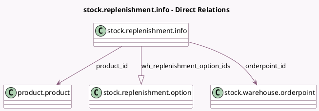

<!-- GENERATED:MODEL -->
---
tags: [odoo, community, generated, model]
---

# stock.replenishment.info

- Module: [[docs/Community Addons/stock/stock|stock]]
- Scope: Community Addons
- Defined in module: yes
- Source files: `wizard/stock_replenishment_info.py`
- Python classes: `StockReplenishmentInfo`
- Description: Stock supplier replenishment information

## Field footprint

- Detected fields: 12
- Field types: `Char` x 3, `Float` x 3, `Integer` x 1, `Many2one` x 2, `One2many` x 2, `Selection` x 1
- Relation fields: 4

## Sample fields

- `based_on`: `Selection`
- `json_lead_days`: `Char` (compute `_compute_json_lead_days`)
- `json_replenishment_graph`: `Char` (compute `_compute_json_replenishment_graph`)
- `orderpoint_id`: `Many2one` (comodel `stock.warehouse.orderpoint`)
- `percent_factor`: `Integer`
- `product_id`: `Many2one` (comodel `product.product`, related `orderpoint_id.product_id`)
- `product_max_qty`: `Float` (comodel `Max`, related `orderpoint_id.product_max_qty`)
- `product_min_qty`: `Float` (comodel `Min`, related `orderpoint_id.product_min_qty`)
- `product_uom_name`: `Char` (related `orderpoint_id.product_uom_name`)
- `qty_to_order`: `Float` (related `orderpoint_id.qty_to_order`)
- `warehouseinfo_ids`: `One2many` (related `orderpoint_id.warehouse_id.resupply_route_ids`)
- `wh_replenishment_option_ids`: `One2many` (comodel `stock.replenishment.option`, compute `_compute_wh_replenishment_options`)

## Method hints

- Detected methods: 6
- Action methods: none
- Compute methods: `_compute_json_lead_days`, `_compute_json_replenishment_graph`, `_compute_wh_replenishment_options`
- Onchange methods: none

## Direct relation diagram

## Navigation

- **Parent:** [[docs/Community Addons/stock/Models]]

<!-- GENERATED:MODEL -->
