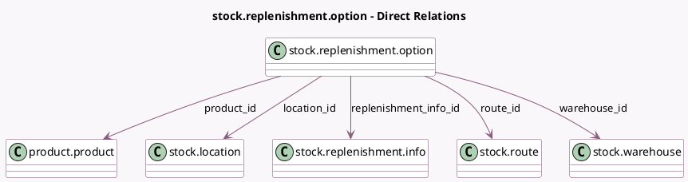

<!-- GENERATED:MODEL -->
---
tags: [odoo, community, generated, model]
---

# stock.replenishment.option

- Module: [[docs/Community Addons/stock/stock|stock]]
- Scope: Community Addons
- Defined in module: yes
- Source files: `wizard/stock_replenishment_info.py`
- Python classes: `StockReplenishmentOption`
- Description: Stock warehouse replenishment option

## Field footprint

- Detected fields: 10
- Field types: `Char` x 3, `Float` x 2, `Many2one` x 5
- Relation fields: 5

## Sample fields

- `free_qty`: `Float` (compute `_compute_free_qty`)
- `lead_time`: `Char` (compute `_compute_lead_time`)
- `location_id`: `Many2one` (comodel `stock.location`, related `warehouse_id.lot_stock_id`)
- `product_id`: `Many2one` (comodel `product.product`)
- `qty_to_order`: `Float` (related `replenishment_info_id.qty_to_order`)
- `replenishment_info_id`: `Many2one` (comodel `stock.replenishment.info`)
- `route_id`: `Many2one` (comodel `stock.route`)
- `uom`: `Char` (related `product_id.uom_name`)
- `warehouse_id`: `Many2one` (comodel `stock.warehouse`, related `route_id.supplier_wh_id`)
- `warning_message`: `Char` (compute `_compute_warning_message`)

## Method hints

- Detected methods: 6
- Action methods: none
- Compute methods: `_compute_free_qty`, `_compute_lead_time`, `_compute_warning_message`
- Onchange methods: none

## Direct relation diagram

## Navigation

- **Parent:** [[docs/Community Addons/stock/Models]]

<!-- GENERATED:MODEL -->
