<!-- GENERATED:MODEL -->
---
tags: [odoo, community, generated, model]
---

# stock.request.count

- Module: [[docs/Community Addons/stock/stock|stock]]
- Scope: Community Addons
- Defined in module: yes
- Source files: `wizard/stock_request_count.py`
- Python classes: `StockRequestCount`
- Description: Stock Request an Inventory Count

## Field footprint

- Detected fields: 4
- Field types: `Boolean` x 1, `Date` x 1, `Many2many` x 1, `Many2one` x 1
- Relation fields: 2

## Sample fields

- `inventory_date`: `Date` (comodel `Scheduled at`)
- `quant_ids`: `Many2many` (comodel `stock.quant`)
- `show_expected_quantity`: `Boolean` (compute `_compute_show_expected_quantity`)
- `user_id`: `Many2one` (comodel `res.users`)

## Method hints

- Detected methods: 5
- Action methods: `action_request_count`
- Compute methods: `_compute_show_expected_quantity`
- Onchange methods: none

## Direct relation diagram

```plantuml
@startuml
!define ODOO_COLOR_PRIMARY #714B67
!define ODOO_COLOR_ACCENT #875A7B
!define ODOO_COLOR_BG #FAF7FA

skinparam backgroundColor ODOO_COLOR_BG
skinparam defaultTextAlignment left
skinparam ArrowColor ODOO_COLOR_ACCENT
skinparam ClassBackgroundColor white
skinparam ClassBorderColor ODOO_COLOR_PRIMARY
skinparam ComponentBackgroundColor white
skinparam ComponentBorderColor ODOO_COLOR_PRIMARY
skinparam NoteBackgroundColor #FFF8FF
skinparam NoteBorderColor ODOO_COLOR_ACCENT
skinparam SequenceLifeLineBorderColor ODOO_COLOR_ACCENT
skinparam SequenceLifeLineBackgroundColor #FFFFFF
skinparam SequenceParticipantBorderColor ODOO_COLOR_PRIMARY
skinparam SequenceParticipantBackgroundColor #FFFFFF
skinparam sequence {
  ArrowColor ODOO_COLOR_ACCENT
  ActorBorderColor ODOO_COLOR_PRIMARY
}
title stock.request.count - Direct Relations
class "stock.request.count" as stock_request_count
class "res.users" as res_users
class "stock.quant" as stock_quant
stock_request_count --> res_users : user_id
stock_request_count .. stock_quant : quant_ids
@enduml
```

## Navigation

- **Parent:** [[docs/Community Addons/stock/Models]]

<!-- GENERATED:MODEL -->
