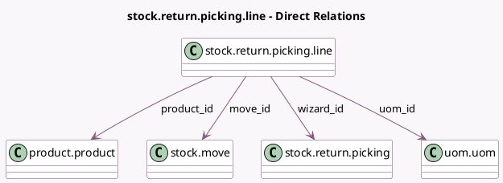

<!-- GENERATED:MODEL -->
---
tags: [odoo, community, generated, model]
---

# stock.return.picking.line

- Module: [[docs/Community Addons/stock/stock|stock]]
- Scope: Community Addons
- Defined in module: yes
- Source files: `wizard/stock_picking_return.py`
- Python classes: `StockReturnPickingLine`
- Description: Return Picking Line

## Field footprint

- Detected fields: 6
- Field types: `Float` x 2, `Many2one` x 4
- Relation fields: 4

## Sample fields

- `move_id`: `Many2one` (comodel `stock.move`)
- `move_quantity`: `Float` (related `move_id.quantity`)
- `product_id`: `Many2one` (comodel `product.product`)
- `quantity`: `Float` (comodel `Quantity`)
- `uom_id`: `Many2one` (comodel `uom.uom`, compute `_compute_uom_id`)
- `wizard_id`: `Many2one` (comodel `stock.return.picking`)

## Method hints

- Detected methods: 3
- Action methods: none
- Compute methods: `_compute_uom_id`
- Onchange methods: none

## Direct relation diagram

## Navigation

- **Parent:** [[docs/Community Addons/stock/Models]]

<!-- GENERATED:MODEL -->
