<!-- GENERATED:MODEL -->
---
tags: [odoo, community, generated, model]
---

# stock.return.picking

- Module: [[docs/Community Addons/stock/stock|stock]]
- Scope: Community Addons
- Defined in module: yes
- Source files: `wizard/stock_picking_return.py`
- Python classes: `StockReturnPicking`
- Description: Return Picking

## Field footprint

- Detected fields: 4
- Field types: `Many2one` x 2, `One2many` x 1, `Selection` x 1
- Relation fields: 3

## Sample fields

- `company_id`: `Many2one` (related `picking_id.company_id`)
- `picking_id`: `Many2one` (comodel `stock.picking`)
- `picking_type_code`: `Selection` (related `picking_id.picking_type_code`)
- `product_return_moves`: `One2many` (comodel `stock.return.picking.line`, compute `_compute_moves_locations`, store `True`)

## Method hints

- Detected methods: 11
- Action methods: `action_create_exchanges`, `action_create_returns`, `action_create_returns_all`
- Compute methods: `_compute_moves_locations`
- Onchange methods: none

## Direct relation diagram

```plantuml
@startuml
!define ODOO_COLOR_PRIMARY #714B67
!define ODOO_COLOR_ACCENT #875A7B
!define ODOO_COLOR_BG #FAF7FA

skinparam backgroundColor ODOO_COLOR_BG
skinparam defaultTextAlignment left
skinparam ArrowColor ODOO_COLOR_ACCENT
skinparam ClassBackgroundColor white
skinparam ClassBorderColor ODOO_COLOR_PRIMARY
skinparam ComponentBackgroundColor white
skinparam ComponentBorderColor ODOO_COLOR_PRIMARY
skinparam NoteBackgroundColor #FFF8FF
skinparam NoteBorderColor ODOO_COLOR_ACCENT
skinparam SequenceLifeLineBorderColor ODOO_COLOR_ACCENT
skinparam SequenceLifeLineBackgroundColor #FFFFFF
skinparam SequenceParticipantBorderColor ODOO_COLOR_PRIMARY
skinparam SequenceParticipantBackgroundColor #FFFFFF
skinparam sequence {
  ArrowColor ODOO_COLOR_ACCENT
  ActorBorderColor ODOO_COLOR_PRIMARY
}
title stock.return.picking - Direct Relations
class "stock.return.picking" as stock_return_picking
class "stock.picking" as stock_picking
class "stock.return.picking.line" as stock_return_picking_line
stock_return_picking --> stock_picking : picking_id
stock_return_picking --|> stock_return_picking_line : product_return_moves
@enduml
```

## Navigation

- **Parent:** [[docs/Community Addons/stock/Models]]

<!-- GENERATED:MODEL -->
