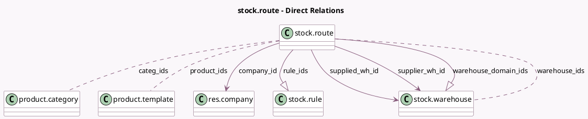

<!-- GENERATED:MODEL -->
---
tags: [odoo, community, generated, model]
---

# stock.route

- Module: [[docs/Community Addons/stock/stock|stock]]
- Scope: Community Addons
- Defined in module: yes
- Source files: `models/stock_location.py`
- Python classes: `StockRoute`
- Description: Inventory Routes

## Field footprint

- Detected fields: 15
- Field types: `Boolean` x 5, `Char` x 1, `Integer` x 1, `Many2many` x 3, `Many2one` x 3, `One2many` x 2
- Relation fields: 8

## Sample fields

- `active`: `Boolean` (comodel `Active`)
- `categ_ids`: `Many2many` (comodel `product.category`)
- `company_id`: `Many2one` (comodel `res.company`)
- `name`: `Char` (comodel `Route`)
- `package_type_selectable`: `Boolean` (comodel `Applicable on Package Type`)
- `product_categ_selectable`: `Boolean` (comodel `Applicable on Product Category`)
- `product_ids`: `Many2many` (comodel `product.template`)
- `product_selectable`: `Boolean` (comodel `Applicable on Product`)
- `rule_ids`: `One2many` (comodel `stock.rule`)
- `sequence`: `Integer` (comodel `Sequence`)
- `supplied_wh_id`: `Many2one` (comodel `stock.warehouse`)
- `supplier_wh_id`: `Many2one` (comodel `stock.warehouse`)
- `warehouse_domain_ids`: `One2many` (comodel `stock.warehouse`, compute `_compute_warehouses`)
- `warehouse_ids`: `Many2many` (comodel `stock.warehouse`)
- `warehouse_selectable`: `Boolean` (comodel `Applicable on Warehouse`)

## Method hints

- Detected methods: 6
- Action methods: none
- Compute methods: `_compute_warehouses`
- Onchange methods: `_onchange_company`, `_onchange_warehouse_selectable`

## Direct relation diagram

## Navigation

- **Parent:** [[docs/Community Addons/stock/Models]]

<!-- GENERATED:MODEL -->
